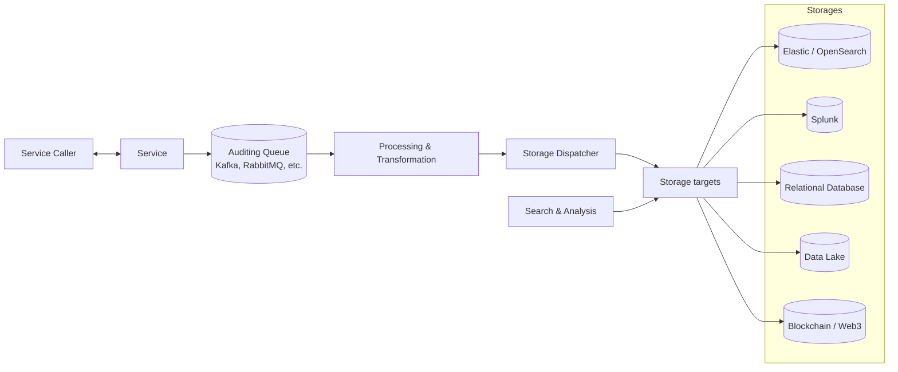

# AuditFlow Sink Configuration Examples



Complete configuration examples for all available sinks.

## Table of Contents

- [Logging & Monitoring](#logging--monitoring)
- [Webhooks & Integration](#webhooks--integration)
- [AWS Services](#aws-services)
- [Google Cloud](#google-cloud)
- [Azure](#azure)
- [NetLicensing Integration](#netlicensing-integration)
- [Complete Multi-Sink Setup](#complete-multi-sink-setup)

---

## Logging & Monitoring

### Syslog Server

Send audit events to your centralized Syslog server.

```yaml
pipelines:
  - name: 'syslog-production'
    enabled: true
    transformer:
      name: 'zero'
    sink:
      name: 'syslog_sink'
      properties:
        host: "syslog.internal.company.com"
        port: "514"
        protocol: "udp"
        facility: "LOCAL0"
        severity: "INFO"
        tag: "auditflow-prod"
        format: "json"
```

### Syslog with CEF Format (Security Tools)

For integration with SIEM tools that expect CEF format.

```yaml
pipelines:
  - name: 'syslog-siem'
    enabled: true
    transformer:
      name: 'zero'
    sink:
      name: 'syslog_sink'
      properties:
        host: "splunk-syslog.company.com"
        port: "514"
        protocol: "tcp"
        facility: "AUTH"
        severity: "NOTICE"
        tag: "auditflow"
        format: "cef"
```

### Console Logging (Development)

```yaml
pipelines:
  - name: 'dev-logs'
    enabled: true
    transformer:
      name: 'zero'
    sink:
      name: 'logging_sink'
      properties:
        log-level: "DEBUG"
        format: "json"
```

---

## Webhooks & Integration

### Zapier Webhook

Send events to Zapier for automation.

```yaml
pipelines:
  - name: 'zapier-integration'
    enabled: true
    transformer:
      name: 'audit_zapier'
    sink:
      name: 'webhook_sink'
      properties:
        webhook-url: "https://hooks.zapier.com/hooks/catch/123456/abcdef/"
        method: "POST"
        content-type: "application/json"
        timeout: "30"
        retry-count: "3"
```

### Webhook with HMAC Signature (Secure)

```yaml
pipelines:
  - name: 'secure-webhook'
    enabled: true
    transformer:
      name: 'zero'
    sink:
      name: 'webhook_sink'
      properties:
        webhook-url: "https://api.example.com/webhooks/audit"
        method: "POST"
        content-type: "application/json"
        secret: "${WEBHOOK_SECRET}"
        signature-header: "X-Hub-Signature-256"
        headers: '{"Authorization": "Bearer ${API_TOKEN}"}'
        verify-ssl: "true"
        retry-count: "5"
```

### Make.com (Integromat)

```yaml
pipelines:
  - name: 'make-integration'
    enabled: true
    transformer:
      name: 'zero'
    sink:
      name: 'webhook_sink'
      properties:
        webhook-url: "https://hook.eu1.make.com/abcd1234xyz"
        method: "POST"
        content-type: "application/json"
```

### n8n Automation

```yaml
pipelines:
  - name: 'n8n-workflow'
    enabled: true
    transformer:
      name: 'zero'
    sink:
      name: 'webhook_sink'
      properties:
        webhook-url: "https://n8n.company.com/webhook/audit"
        method: "POST"
        content-type: "application/json"
        verify-ssl: "true"
```

---

## AWS Services

### AWS S3 - Simple Storage

Store raw audit events in S3 for long-term retention.

```yaml
pipelines:
  - name: 's3-archive'
    enabled: true
    transformer:
      name: 'zero'
    sink:
      name: 'aws_s3_sink'
      properties:
        bucket: "company-audit-logs"
        prefix: "auditflow/"
        region: "us-east-1"
        compress: "true"
        partition-by-date: "true"
        partition-format: "year=%Y/month=%m/day=%d/"
```

### AWS S3 - With Credentials

```yaml
pipelines:
  - name: 's3-with-creds'
    enabled: true
    transformer:
      name: 'zero'
    sink:
      name: 'aws_s3_sink'
      properties:
        bucket: "audit-bucket"
        prefix: "production/"
        region: "eu-west-1"
        access-key-id: "${AWS_ACCESS_KEY_ID}"
        secret-access-key: "${AWS_SECRET_ACCESS_KEY}"
        compress: "true"
```

### AWS S3 - Custom Partitioning

```yaml
pipelines:
  - name: 's3-custom-partition'
    enabled: true
    transformer:
      name: 'zero'
    sink:
      name: 'aws_s3_sink'
      properties:
        bucket: "audit-logs"
        prefix: "events/"
        region: "us-west-2"
        partition-by-date: "true"
        partition-format: "env=prod/year=%Y/month=%m/day=%d/hour=%H/"
        compress: "true"
```

### AWS CloudWatch Logs

Send events to CloudWatch for real-time monitoring.

#### Basic Configuration (Auto-create resources)

```yaml
pipelines:
  - name: 'cloudwatch-prod'
    enabled: true
    transformer:
      name: 'zero'
    sink:
      name: 'aws_cloudwatch_sink'
      properties:
        log-group: "/aws/auditflow/production"
        log-stream: "app-events"
        region: "us-east-1"
        create-log-group: "true"
        create-log-stream: "true"
```

#### With Explicit Credentials

```yaml
pipelines:
  - name: 'cloudwatch-with-creds'
    enabled: true
    transformer:
      name: 'zero'
    sink:
      name: 'aws_cloudwatch_sink'
      properties:
        log-group: "/aws/auditflow/production"
        log-stream: "app-events"
        region: "us-east-1"
        access-key-id: "${AWS_ACCESS_KEY_ID}"
        secret-access-key: "${AWS_SECRET_ACCESS_KEY}"
        create-log-group: "true"
        create-log-stream: "true"
```

#### Specific AWS Organization Account

For sending logs to a specific AWS account in your organization:

```yaml
pipelines:
  - name: 'cloudwatch-org-account'
    enabled: true
    transformer:
      name: 'zero'
    sink:
      name: 'aws_cloudwatch_sink'
      properties:
        log-group: "/aws/auditflow/production"
        log-stream: "app-events"
        region: "us-east-1"
        # Use IAM role for cross-account access
        # Note: Configure IAM role ARN in your pod/container IAM settings
        create-log-group: "false"  # Pre-create in target account
        create-log-stream: "true"
```

**Setup Steps for Cross-Account Access:**

1. **In the Target AWS Account** (where logs will be stored):
   
   Create the log group:
   ```bash
   aws logs create-log-group \
     --log-group-name /aws/auditflow/production \
     --region us-east-1
   ```

2. **Create IAM Role in Target Account**:
   ```json
   {
     "Version": "2012-10-17",
     "Statement": [
       {
         "Effect": "Allow",
         "Principal": {
           "AWS": "arn:aws:iam::SOURCE-ACCOUNT-ID:root"
         },
         "Action": "sts:AssumeRole"
       }
     ]
   }
   ```

3. **Attach Policy to Role**:
   ```json
   {
     "Version": "2012-10-17",
     "Statement": [
       {
         "Effect": "Allow",
         "Action": [
           "logs:CreateLogStream",
           "logs:PutLogEvents",
           "logs:DescribeLogStreams"
         ],
         "Resource": [
           "arn:aws:logs:us-east-1:TARGET-ACCOUNT-ID:log-group:/aws/auditflow/production:*"
         ]
       }
     ]
   }
   ```

4. **In Source Account** (where auditflow runs):
   
   Configure your pod/service to assume the cross-account role using:
   - IAM Role for Service Accounts (IRSA) in EKS, or
   - EC2 Instance Profile with assume role permissions

#### Using AWS Organizations with IAM Identity Center

If using AWS IAM Identity Center (formerly SSO):

```yaml
pipelines:
  - name: 'cloudwatch-sso'
    enabled: true
    transformer:
      name: 'zero'
    sink:
      name: 'aws_cloudwatch_sink'
      properties:
        log-group: "/aws/auditflow/production"
        log-stream: "app-events"
        region: "us-east-1"
        # Let the AWS SDK use the default credential chain
        # which includes SSO credentials
        create-log-group: "false"
        create-log-stream: "true"
```

**Required IAM Permissions:**

Minimum permissions needed:
```json
{
  "Version": "2012-10-17",
  "Statement": [
    {
      "Effect": "Allow",
      "Action": [
        "logs:CreateLogGroup",
        "logs:CreateLogStream",
        "logs:PutLogEvents",
        "logs:DescribeLogGroups",
        "logs:DescribeLogStreams"
      ],
      "Resource": [
        "arn:aws:logs:*:*:log-group:/aws/auditflow/*"
      ]
    }
  ]
}
```

### AWS CloudTrail Lake

Send events to CloudTrail Lake for compliance and auditing.

```yaml
pipelines:
  - name: 'cloudtrail-compliance'
    enabled: true
    transformer:
      name: 'audit_cloudtrail'
    sink:
      name: 'aws_cloudtrail_sink'
      properties:
        channel-arn: "arn:aws:cloudtrail:us-east-1:123456789012:channel/audit-channel"
        region: "us-east-1"
```

---

## Google Cloud

### Google Cloud Storage - Basic

```yaml
pipelines:
  - name: 'gcs-archive'
    enabled: true
    transformer:
      name: 'zero'
    sink:
      name: 'gcs_sink'
      properties:
        bucket: "company-audit-logs"
        prefix: "auditflow/"
        project-id: "my-gcp-project"
        compress: "true"
        partition-by-date: "true"
```

### Google Cloud Storage - With Service Account

```yaml
pipelines:
  - name: 'gcs-with-sa'
    enabled: true
    transformer:
      name: 'zero'
    sink:
      name: 'gcs_sink'
      properties:
        bucket: "audit-bucket"
        prefix: "production/"
        credentials-file: "/etc/gcp/service-account.json"
        compress: "true"
        partition-by-date: "true"
        partition-format: "dt=%Y-%m-%d/"
```

---

## Azure

### Azure Blob Storage - Connection String

```yaml
pipelines:
  - name: 'azure-archive'
    enabled: true
    transformer:
      name: 'zero'
    sink:
      name: 'azure_blob_sink'
      properties:
        container: "audit-logs"
        connection-string: "${AZURE_STORAGE_CONNECTION_STRING}"
        prefix: "auditflow/"
        compress: "true"
        partition-by-date: "true"
```

### Azure Blob Storage - Account Key

```yaml
pipelines:
  - name: 'azure-with-key'
    enabled: true
    transformer:
      name: 'zero'
    sink:
      name: 'azure_blob_sink'
      properties:
        container: "production-logs"
        account-name: "mycompanyaudit"
        account-key: "${AZURE_STORAGE_KEY}"
        prefix: "events/"
        compress: "true"
```

---

## NetLicensing Integration

The NetLicensing sink processes checkout transaction events from Labs64 IO Ecosystem and automatically creates Licensee and License entities in NetLicensing.

### Basic Configuration

Process checkout transactions and create licenses automatically.

```yaml
pipelines:
  - name: 'netlicensing-provisioning'
    enabled: true
    condition:
      field: "eventType"
      operator: "startsWith"
      value: "checkout.transaction"
    transformer:
      name: 'zero'
    sink:
      name: 'netlicensing_sink'
      properties:
        api-key: "${NETLICENSING_API_KEY}"
        product-number: "P12345678"
        license-template-number: "LT12345678"
```

### With Custom NetLicensing Instance

For self-hosted or custom NetLicensing deployments.

```yaml
pipelines:
  - name: 'netlicensing-custom'
    enabled: true
    condition:
      field: "eventType"
      operator: "equals"
      value: "checkout.transaction.completed"
    transformer:
      name: 'zero'
    sink:
      name: 'netlicensing_sink'
      properties:
        api-key: "${NETLICENSING_API_KEY}"
        base-url: "https://custom.netlicensing.example.com/core/v2/rest/"
        product-number: "MYPRODUCT"
        license-template-number: "SUBSCRIPTION"
        timeout: "60"
        retry-count: "5"
```

### Quantity-to-Licensee Mode

Create a new licensee for each unit purchased (useful for volume licenses).

```yaml
pipelines:
  - name: 'netlicensing-volume'
    enabled: true
    condition:
      field: "eventType"
      operator: "startsWith"
      value: "checkout.transaction"
    transformer:
      name: 'zero'
    sink:
      name: 'netlicensing_sink'
      properties:
        api-key: "${NETLICENSING_API_KEY}"
        product-number: "VOLUME-PRODUCT"
        license-template-number: "SINGLE-USER"
        quantity-to-licensee: "true"
        mark-for-transfer: "true"
        save-transaction-data: "true"
```

### Multiple Products Configuration

Handle different products by specifying in purchase order item extra fields.

```yaml
pipelines:
  - name: 'netlicensing-multi-product'
    enabled: true
    condition:
      field: "eventType"
      operator: "equals"
      value: "checkout.transaction.completed"
    transformer:
      name: 'zero'
    sink:
      name: 'netlicensing_sink'
      properties:
        api-key: "${NETLICENSING_API_KEY}"
        # No default product/template - taken from item.extra
        mark-for-transfer: "true"
        save-transaction-data: "true"
```

**Note:** When using multi-product configuration, each purchase order item should include:

```json
{
  "name": "Enterprise License",
  "sku": "ENT-001",
  "quantity": 1,
  "price": 99900,
  "extra": {
    "productNumber": "P-ENTERPRISE",
    "licenseTemplateNumber": "LT-ANNUAL"
  }
}
```

### Expected Checkout Event Structure

The sink expects checkout transaction events with this structure:

```json
{
  "eventType": "checkout.transaction.completed",
  "sourceSystem": "checkout",
  "tenantId": "T123456",
  "extra": {
    "transaction": {
      "id": "txn-uuid",
      "status": "COMPLETED",
      "paymentMethod": "STRIPE",
      "billingInfo": {
        "firstName": "John",
        "lastName": "Doe",
        "email": "john@example.com",
        "country": "US"
      },
      "purchaseOrder": {
        "id": "po-uuid",
        "currency": "USD",
        "customer": {
          "id": "cust-uuid",
          "firstName": "John",
          "lastName": "Doe",
          "email": "john@example.com"
        },
        "items": [
          {
            "name": "Annual License",
            "sku": "LIC-ANNUAL",
            "quantity": 2,
            "price": 9900,
            "extra": {
              "productNumber": "P12345678",
              "licenseTemplateNumber": "LT12345678"
            }
          }
        ]
      }
    }
  }
}
```

### Configuration Properties Reference

| Property | Required | Default | Description |
|----------|----------|---------|-------------|
| `api-key` | Yes | - | NetLicensing API key |
| `base-url` | No | `https://go.netlicensing.io/core/v2/rest/` | NetLicensing API base URL |
| `product-number` | No | - | Default product number (if not in event) |
| `license-template-number` | No | - | Default license template (if not in event) |
| `quantity-to-licensee` | No | `false` | Create new licensee per quantity unit |
| `mark-for-transfer` | No | `true` | Mark licensees for transfer |
| `save-transaction-data` | No | `true` | Store transaction data in licensee properties |
| `timeout` | No | `30` | Request timeout in seconds |
| `retry-count` | No | `3` | Number of retry attempts |

---

## Complete Multi-Sink Setup

### Production-Ready Configuration

Send audit events to multiple destinations simultaneously.

```yaml
sink:
  discovery:
    mode: kubernetes
  service:
    name: auditflow-sink
    namespace: labs64io
    port: 8082

pipelines:
  # Real-time monitoring
  - name: 'cloudwatch-realtime'
    enabled: true
    transformer:
      name: 'zero'
    sink:
      name: 'aws_cloudwatch_sink'
      properties:
        log-group: "/aws/auditflow/production"
        log-stream: "events"
        region: "us-east-1"

  # Long-term S3 archive
  - name: 's3-archive'
    enabled: true
    transformer:
      name: 'zero'
    sink:
      name: 'aws_s3_sink'
      properties:
        bucket: "company-audit-archive"
        prefix: "auditflow/"
        region: "us-east-1"
        compress: "true"
        partition-by-date: "true"

  # Compliance (CloudTrail Lake)
  - name: 'cloudtrail-compliance'
    enabled: true
    transformer:
      name: 'audit_cloudtrail'
    sink:
      name: 'aws_cloudtrail_sink'
      properties:
        channel-arn: "${CLOUDTRAIL_CHANNEL_ARN}"
        region: "us-east-1"

  # SIEM Integration
  - name: 'siem-syslog'
    enabled: true
    transformer:
      name: 'zero'
    sink:
      name: 'syslog_sink'
      properties:
        host: "splunk.company.com"
        port: "514"
        protocol: "tcp"
        facility: "AUTH"
        severity: "INFO"
        format: "cef"

  # Alerting & Automation
  - name: 'zapier-alerts'
    enabled: true
    transformer:
      name: 'audit_zapier'
    sink:
      name: 'webhook_sink'
      properties:
        webhook-url: "${ZAPIER_WEBHOOK_URL}"
        method: "POST"
        secret: "${ZAPIER_SECRET}"

  # OpenSearch for search & analytics
  - name: 'opensearch-analytics'
    enabled: true
    transformer:
      name: 'audit_opensearch'
    sink:
      name: 'opensearch_sink'
      properties:
        service-url: "https://opensearch.company.com:9200"
        service-path: "/audit/_doc"
        username: "${OPENSEARCH_USER}"
        password: "${OPENSEARCH_PASSWORD}"
```

---

## Environment-Specific Configurations

### Development

```yaml
pipelines:
  - name: 'dev-console'
    enabled: true
    transformer:
      name: 'zero'
    sink:
      name: 'logging_sink'
      properties:
        log-level: "DEBUG"
        format: "json"
```

### Staging

```yaml
pipelines:
  - name: 'staging-s3'
    enabled: true
    transformer:
      name: 'zero'
    sink:
      name: 'aws_s3_sink'
      properties:
        bucket: "staging-audit-logs"
        prefix: "auditflow/"
        region: "us-east-1"
  
  - name: 'staging-webhook'
    enabled: true
    transformer:
      name: 'zero'
    sink:
      name: 'webhook_sink'
      properties:
        webhook-url: "${STAGING_WEBHOOK_URL}"
```

### Production

See "Complete Multi-Sink Setup" above.

---

## Tips & Best Practices

### 1. Use Environment Variables

```yaml
properties:
  password: "${OPENSEARCH_PASSWORD}"
  api-key: "${API_KEY}"
```

### 2. Enable Compression for Cloud Storage

```yaml
properties:
  compress: "true"  # Saves storage costs
```

### 3. Partition by Date

```yaml
properties:
  partition-by-date: "true"
  partition-format: "year=%Y/month=%m/day=%d/"
```

### 4. Multiple Sinks for Redundancy

Configure multiple sinks to ensure events are captured even if one fails.

### 5. Transform Before Sending

Use transformers to format events for specific destinations:
- `audit_opensearch` - OpenSearch format
- `audit_loki` - Loki format
- `audit_cloudtrail` - CloudTrail format
- `audit_zapier` - Zapier-friendly format

---

## Testing Sinks

```bash
# Test webhook sink
curl -X POST "http://localhost:8082/sink/webhook_sink" \
  -H "Content-Type: application/json" \
  -d '{
    "event_data": {"meta": {"eventType": "test"}},
    "properties": {
      "webhook-url": "https://webhook.site/unique-id"
    }
  }'

# Test S3 sink
curl -X POST "http://localhost:8082/sink/aws_s3_sink" \
  -H "Content-Type: application/json" \
  -d '{
    "event_data": {"meta": {"eventType": "test"}},
    "properties": {
      "bucket": "my-test-bucket",
      "region": "us-east-1"
    }
  }'
```
