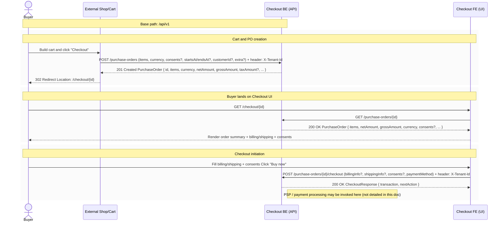
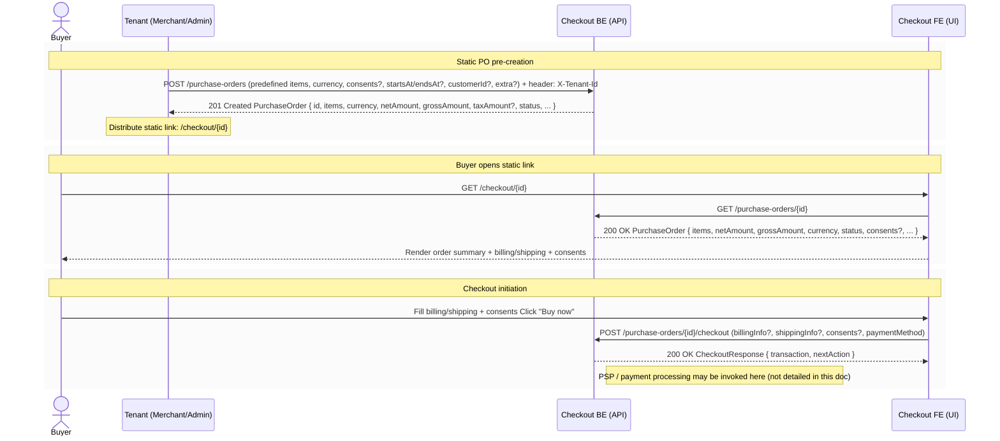

# Checkout Service Specification (draft)

This document describes the domain, core terms, and key flows of the Checkout service.  
Full data models, fields, and status definitions are provided in the OpenAPI specification (`openapi-checkout.yaml`).

---

## 1. Core Definitions and Abbreviations

This section defines the main entities, abbreviations, and roles used in this documentation and in the API.

### 1.1. Core Domain Entities

**PO (Purchase Order)**  
The primary order object. It holds the order content (items), prices, quantities, currency, and calculated totals (`netAmount`, `grossAmount`, `taxAmount`).  
A PO is created before any payment is attempted and acts as the source of truth for what the buyer is about to pay for.

**CTX (Checkout Transaction)**  
A financial object created when the buyer initiates payment via  
`POST /purchase-orders/{id}/checkout`.  
A CTX stores:
- a reference to the originating PO;
- the BillingInfo (BI) and ShippingInfo (SI) as provided at checkout time;
- the selected `paymentMethod`;
- the transaction status (e.g., PENDING, FAILED, CANCELED, COMPLETED);

CTX is read-only for clients and is exposed via `/checkout-transactions` and `/checkout-transactions/{id}`.

**BI (Billing Info)**  
Buyer information required for invoicing and/or legal compliance (name, address, email, VAT ID, etc.).  
The structure is defined in the `BillingInfo` schema.

**SI (Shipping Info)**  
Information required for physical delivery (address, recipient name, phone, etc.).  
Used when the product or service involves shipping.  
The structure is defined in the `ShippingInfo` schema.

**ConsentDefinition (PO-level consent)**  
A consent item defined on a Purchase Order. It describes what the buyer should be asked to agree to.  
Fields: `id`, `label`, optional `url`, and `required`.

**ConsentsMap (checkout-time acceptance map)**  
A map of `{ [consentId]: boolean }` provided by the client during checkout.  
Keys must match `PurchaseOrder.consents[].id`.  
`true` means accepted; `false` or a missing key means not accepted.

The Checkout service does not collect consents itself — the client (UI) is responsible for presenting them.
The service validates that all PO consents with `required=true` are accepted in the `ConsentsMap`.

### 1.2. Actors

**Tenant (Seller / Merchant)**  
The owner of the Checkout configuration, on whose behalf Purchase Orders and Checkout Transactions are created.

**Buyer (Customer / Client)**  
The end customer who sees the Checkout UI and goes through the payment process.  
The Buyer may be anonymous from the Checkout service perspective.

**Checkout UI (Frontend / FE)**  
The frontend application that:
- displays the content of a Purchase Order;
- collects BI / SI;
- allows the Buyer to select a `paymentMethod`;
- calls the Checkout API, including `POST /purchase-orders/{id}/checkout`.

**Checkout Backend (Backend / BE)**  
The backend service implementing all APIs described in `openapi-checkout.yaml`.  
It is responsible for:
- creating and reading Purchase Orders,
- creating Checkout Transactions,
- integrating with PSPs,
- returning `nextAction` instructions to the client.

**PSP (Payment Service Provider)**  
An external payment gateway or service (e.g. Stripe).  
The Checkout Backend initiates communication with the PSP and returns `nextAction` instructions (such as a redirect URL) to the client.

### 1.3. Key Fields of PO and CheckoutTransaction

The full list of fields is defined in the OpenAPI specification. This section highlights only the most important concepts.

**PurchaseOrder (PO)** — key field groups:

- Identification:
    - `id` — UUID of the PO.
- Order content:
    - `items[]` — array of order line items (`PurchaseOrderItem`), including `name`, `price`, `quantity`, `tax`, `extra`, and others.
- Currency and totals:
    - `currency` — PO currency, ISO-4217, 3 uppercase letters;
    - `netAmount` — total amount of all items (excluding shipping and tax), in minor units;
    - `grossAmount` — final total (net + tax + shipping), in minor units;
    - `taxAmount` — total tax amount applied.
- Consents:
    - `consents[]` — list of `ConsentDefinition` items (what must be shown/accepted by the buyer).
- Temporal fields:
    - `startsAt`, `endsAt` — (optional) validity window of the offer;
    - `createdAt`, `updatedAt` — audit timestamps.
- Additional data:
    - `extra` —  optional key-value metadata (Record<string, string | number | boolean>) for integrations/client 
                 attributes (max 50 keys; key ≤ 40 chars; string value ≤ 500 chars; values only string/number/boolean).

#### PO validity period (`startsAt` / `endsAt`)

The `startsAt` and `endsAt` fields define the time window during which a PurchaseOrder is considered valid for starting a checkout.

Interpretation of different combinations:

- **Both fields missing (`startsAt` and `endsAt` not set)**  
  The PO is considered valid immediately after creation and has no time-based expiry.  
  It never becomes “expired” automatically.

- **Only `startsAt` is set**  
  This represents a *scheduled / delayed* PO.
    - Before `startsAt`, the PO is not active and checkout attempts will be rejected by the backend.
    - From `startsAt` onwards, the PO is considered active **with no expiration date**.

- **Only `endsAt` is set**  
  This represents “valid from creation time, but with a deadline”.
    - The PO is considered valid from the actual creation time until `endsAt`.
    - After `endsAt`, the PO is treated as expired and checkout attempts will be rejected by the backend.

- **Both `startsAt` and `endsAt` are set**
    - The PO is valid only within the interval `[startsAt, endsAt]`.
    - Before `startsAt` — the PO is not yet active.
    - After `endsAt` — the PO is expired.

**CheckoutTransaction (CTX)** — key field groups:

- Identification:
    - `id` — UUID of the Checkout Transaction;
- Status:
    - `status` — current transaction state (PENDING, FAILED, CANCELED, COMPLETED).
- Related entities:
    - `purchaseOrder` — snapshot of the PO at checkout time;
    - `billingInfo` — buyer’s BI;
    - `shippingInfo` — buyer’s SI.
- Consents:
    - `consents` — buyer acceptance map (`ConsentsMap`: `{ [consentId]: boolean }`).
- Payment:
    - `paymentMethod` — code of the selected payment method / PSP.
- Temporal fields:
    - `createdAt`, `updatedAt`, `closedAt` — timestamps describing the lifecycle of the CTX.

### 1.4. Money Rules

- All monetary amounts are stored in **minor units** (for example, cents for USD/EUR).
- Each Purchase Order has **exactly one** `currency`, used for all its items.
- Calculated fields (`netAmount`, `grossAmount`, `taxAmount`) are **read-only** and are computed exclusively on the server side.
- Tax calculations use the `Tax` structure with:
    - `rateType` (PERCENTAGE / FIXED),
    - `rate` expressed in minor units for the tax rate.
---

## 2. Dynamic PO Flow (cart-driven)

This scenario is designed for interactive e-commerce solutions where the order content is finalized only shortly before the buyer is ready to pay.  
In this case, a PO is created **dynamically** for a specific shopping session/cart.

### 2.1. When it is used

- The buyer builds a cart in an external shop / UI.
- After pressing the “Checkout” button, the external system creates a PO via the Checkout API.
- The buyer is redirected to `{checkout_ui_base_url}/checkout/{PO.id}` in the Checkout UI.

### 2.2. High-level flow steps

1. **PO creation (Cart → Checkout API)**  
   The external system (Cart/Shop) sends a  
   `POST /purchase-orders` request with items and currency.  
   The Checkout Backend creates a PO and calculates the totals.

2. **PO identifier retrieval**  
   The response contains a `PurchaseOrder` object, including its `id`.

3. **Redirect to Checkout UI**  
   The external UI or backend constructs the URL  
   `{checkout_ui_base_url}/checkout/{PO.id}`  
   and redirects or links the buyer to it.

4. **PO loading and buyer data input**  
   The Checkout UI calls `GET /purchase-orders/{PO.id}`, displays the order content (items, totals),  
   and collects BI / SI, buyer consents acceptance (ConsentsMap), and a `paymentMethod` from the buyer.

5. **Checkout initiation (CTX creation)**  
   After the buyer clicks “Purchase” (or similar), the UI or a backend proxy calls  
   `POST /purchase-orders/{PO.id}/checkout`  
   with a `CheckoutRequest` containing `billingInfo`, `shippingInfo`, optional `consents` (ConsentsMap), 
   and `paymentMethod`.

6. **CTX creation and PSP communication**  
   The Checkout Backend:
    - creates a new `CheckoutTransaction` (CTX) linked to the PO;
    - stores BI/SI and `paymentMethod`;
    - initiates communication with the PSP (if required).

7. **Next-action response**  
   The API returns a `CheckoutResponse` containing:
    - the `transaction` (CTX),
    - the `nextAction` object (action type, redirect URL, optional `expiresAt`).

8. **Finalization at the PSP**  
   The Checkout UI executes the `nextAction` (for example, redirects the buyer to the PSP).  
   The final transaction status (COMPLETED / FAILED / CANCELED) is determined and stored via PSP integration (out of scope for this document).

#### Dynamic PO Flow Diagram

## 3. Static PO Flow (static pages / landing-driven)

This scenario is suitable for static or recurring offers (e.g. a “Buy plan X” button, a fixed-price service, or a landing page product) where a PO is created **upfront** and potentially reused by multiple buyers.

### 3.1. When it is used

- There is a static landing page / plan page / “Buy X” button.
- A tenant or admin creates a PO upfront via backoffice or API.
- Any user who follows the public link lands in the Checkout UI using that PO.

### 3.2. High-level flow steps

1. **PO pre-creation (Tenant → Checkout API)**  
   The Tenant creates the PO via  
   `POST /purchase-orders`, either manually or via an internal tool.

2. **Public link generation**  
   The Tenant retrieves `PO.id` and embeds a public checkout link  
   `{checkout_ui_base_url}/checkout/{PO.id}`  
   on a landing page, in emails, widgets, etc.

3. **Buyer session start**  
   The Buyer clicks the link and lands in the Checkout UI, where the predefined order content is displayed.

4. **BI/SI input and payment method selection**  
   From this point on, the behavior is identical to the Dynamic Flow: the buyer enters BI/SI, provides consents 
   acceptance (ConsentsMap), and selects a `paymentMethod`.

5. **Checkout initiation**  
   The UI calls `POST /purchase-orders/{PO.id}/checkout`  
   (same as step 5 in the Dynamic Flow).

6. **CTX creation and nextAction response**  
   The Checkout Backend creates a new `CheckoutTransaction`, initiates payment with the PSP, 
   and returns a `CheckoutResponse` with `transaction` and `nextAction`.

7. **Finalization at the PSP**  
   The Buyer completes payment on the PSP side.  
   Each attempt creates its own CTX, even if the underlying PO is the same.

#### Static PO Flow Diagram

