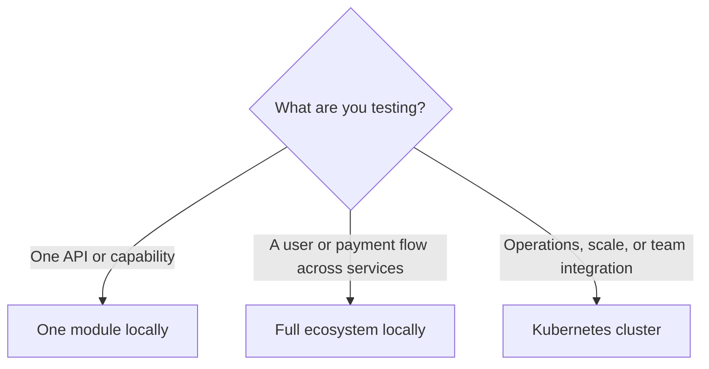

# Choose a Deployment Path

Choose the smallest environment that will answer your current question. All paths preserve the same core boundaries: services own their data, traffic crosses the gateway, and configuration stays outside application code.

| Path | Choose it when | Time to first result | Best next step |
|---|---|---|---|
| One module locally | You need to validate a focused capability or API | Minutes | [Run one module locally](./run-one-module-locally.md) |
| Full ecosystem locally | You need to inspect cross-service behavior | A local setup session | [Run the full ecosystem locally](./run-the-full-ecosystem-locally.md) |
| Kubernetes cluster | You are creating a shared, durable environment | A planned deployment | [Deploy to your Kubernetes cluster](./deploy-to-kubernetes.md) |

## Prerequisites by path

| Requirement | One module | Full ecosystem | Kubernetes cluster |
|---|---:|---:|---:|
| Docker | Required | Required | Required for image workflows |
| `just` | Usually | Required | Recommended |
| k3d | — | Required | Optional |
| Helm | — | Required | Required |
| kubectl | — | Recommended | Required |

Do not use local defaults as production configuration. The Kubernetes guide includes the security, persistence, and observability decisions required before go-live.
