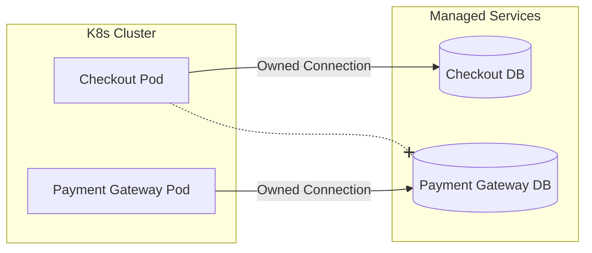

# Deployment

Labs64.IO is built for Kubernetes and ships with official Helm charts for every deployable module. This page outlines the deployment modes and considerations for taking the ecosystem to production.

## Deployment Modes

### 1. Local Development (k3d)
Used by developers and evaluators. The entire ecosystem is deployed to a lightweight local cluster.
- **Tooling:** `k3d`, `helmfile`, `just`
- **Use Case:** Validating API contracts, debugging module interactions.

### 2. AWS QA / Staging / Production
The recommended path for production workloads.
- **Tooling:** EKS, RDS (PostgreSQL), Amazon MQ (RabbitMQ), ArgoCD.
- **Use Case:** High availability, secure, and scalable deployments.

### 3. Bring Your Own Infrastructure (BYO)
Labs64.IO is agnostic to the underlying cloud provider. As long as you provide a Kubernetes cluster, a PostgreSQL-compatible database, and a RabbitMQ broker, the Helm charts will function correctly.

## Helm Chart Repository

All modules are published to the official Labs64.IO Helm repository.

```bash
helm repo add labs64io https://labs64.github.io/labs64.io-helm-charts
helm repo update
helm search repo labs64io
```

## Infrastructure Ownership

Modules in Labs64.IO follow a strict **database-per-service** pattern. 
- You must provision separate logical databases (or entirely separate instances) for modules that require persistence (e.g., Checkout, Payment Gateway).
- AuditFlow is a router and does not own a persistent store; it relies entirely on external sinks (e.g., OpenSearch, S3).



*Note: Services never cross-connect to another service's database.*
