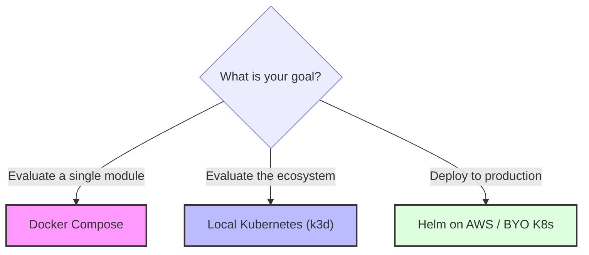
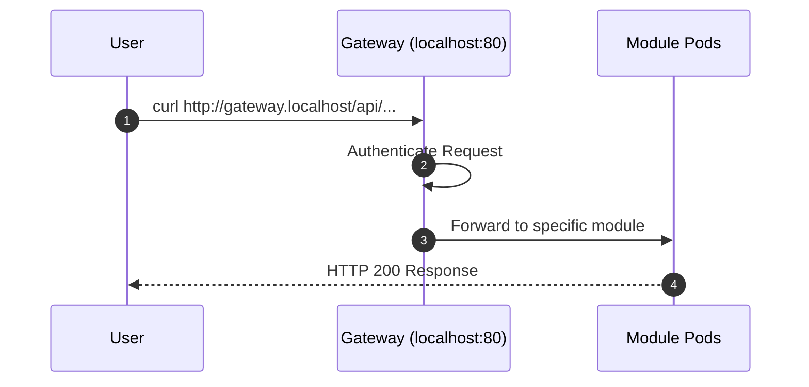

# Getting Started

This guide walks you through the complete process of standing up the Labs64.IO Ecosystem from zero to a running deployment. We provide two main paths for evaluation: Docker Compose for a quick single-module spin-up, and local Kubernetes (k3d) for evaluating the complete ecosystem.

## 1. Introduction

Labs64.IO provides flexibility. You don't have to run the entire platform. If you only need AuditFlow today, you can run only AuditFlow. The shared gateway makes it easy to add modules later without changing your edge architecture.

## 2. Prerequisites

Ensure you have the following installed on your machine:
- **Docker** (Required for all options)
- **just** (Command runner, required for local tooling)
- **k3d & Helm** (Required only for the Kubernetes deployment)
- **Java 25 & Maven** (Required only for the single-module build)

## 3. Choose Your Deployment Option



## 4. Docker Quick Start (Single Module)

The fastest way to verify the ecosystem mechanics is to run AuditFlow in isolation using Docker Compose.

1. Clone the module:
   ```bash
   git clone https://github.com/Labs64/labs64.io-auditflow.git
   cd labs64.io-auditflow
   ```
2. Start the module:
   ```bash
   just up
   ```

*The first run will take time to resolve Maven dependencies and build the container image. Subsequent runs are near-instant.*

## 5. Kubernetes / Helm Deployment (Full Ecosystem)

To see the modules working together behind the Auth Gateway, deploy the entire stack to a local k3d cluster.

1. Clone the workspace:
   ```bash
   git clone https://github.com/Labs64/labs64.io-workspace.git labs64.io
   cd labs64.io
   ```
2. Verify tooling and clone all modules:
   ```bash
   just doctor
   just clone
   ```
3. Build and deploy:
   ```bash
   just up
   ```

## 6. Configure Modules

By default, the `just up` command uses the standard configuration defined in `values-local.yaml`. You can modify module behavior by adjusting these values or using the `obs` (observability) overlays.

For deep dives into configuration properties, refer to the **[Configuration](./configuration.html)** guide.

## 7. Verify Installation

### Verify Docker Compose (AuditFlow)
Publish a test event and check the response:
```bash
curl -sS -i -X POST http://localhost:8080/audit/publish \
  -H 'Content-Type: application/json' \
  -d '{"eventType":"demo.event","sourceSystem":"demo","extra":{"hello":"world"}}'
```
*Expected: `HTTP/1.1 200` with an `X-Audit-Event-Id` header.*

### Verify Kubernetes
Check that the Auth Gateway is routing correctly:
1. Open your browser to `http://gateway.localhost`
2. Run `kubectl get pods` to ensure all deployable modules (`auditflow`, `auth-gateway`, `checkout`, `payment-gateway`, `customer-portal`) are in the `Running` state.



## 8. Explore APIs

Every module publishes an OpenAPI specification. In the Kubernetes deployment, these are aggregated at the edge:
- **API Docs:** `http://gateway.localhost/docs`

You can use the aggregated Swagger UI to execute requests directly against the live modules.

## 9. Next Steps

- Review **[Deployment Options](./deployment.html)** to plan your production rollout.
- Explore individual **[Modules](../modules/)** to understand capabilities and advanced configurations.
- Hit an issue? Check the **[Troubleshooting](./troubleshooting.html)** guide.
