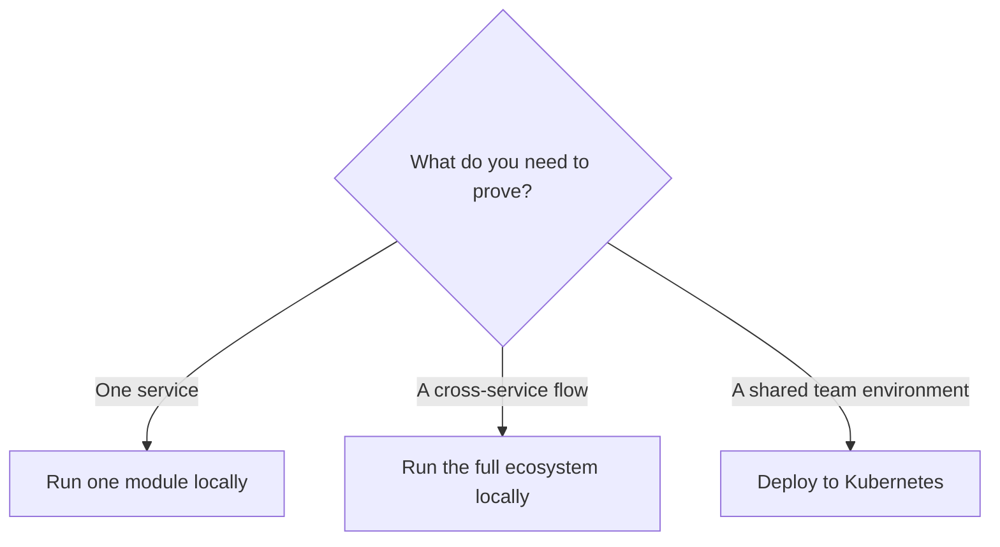

# Get Started

Start with the smallest environment that answers your question. You can evaluate a service by itself, exercise the whole ecosystem locally, or move directly to a Kubernetes cluster.

## Pick a path

| Your goal | Recommended path | What you get |
|---|---|---|
| Validate one capability fast | [Run one module locally](./run-one-module-locally.md) | A focused local service environment |
| See services work together | [Run the full ecosystem locally](./run-the-full-ecosystem-locally.md) | Gateway, modules, and supporting services in k3d |
| Prepare an environment for a team | [Deploy to your Kubernetes cluster](./deploy-to-kubernetes.md) | Helm-based installation model and go-live checklist |

If you are not sure which one applies, use the [deployment path guide](./choose-a-deployment-path.md).

## What to expect

Labs64.IO is modular: you do not have to adopt the whole platform on day one. A shared edge and consistent contracts make it possible to add services deliberately as your needs grow.

## Before you begin

Install Docker for every path. The local ecosystem path also uses `just`, k3d, and Helm. A service repository may require its own language runtime when you build it from source; its quick start tells you exactly what is needed.

> **Fastest first step:** [run a module locally](./run-one-module-locally.md). It gives you a real endpoint and a contained environment without asking you to operate the entire stack.
