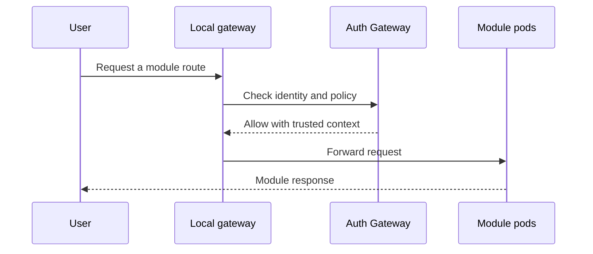

# Run the Full Ecosystem Locally

Run the workspace in a local k3d cluster when you need to exercise routing, identity, events, and multiple services together.

## 1. Prepare the workspace

```bash
git clone https://github.com/Labs64/labs64.io-workspace.git labs64.io
cd labs64.io
just doctor
just clone
just up
```

The workspace prepares the repositories and deploys the local Helm-based environment.

## 2. Confirm the platform is healthy

```bash
kubectl get pods
```

Open `http://gateway.localhost` and use the aggregated API documentation at `http://gateway.localhost/docs` when it is available in your local environment.



## 3. Explore a workflow

Use the [Services & Modules](../modules/index.md) area to select a capability. When you are ready to make environment decisions such as storage, ingress, and observability, continue to [Deploy to your Kubernetes cluster](./deploy-to-kubernetes.md).
