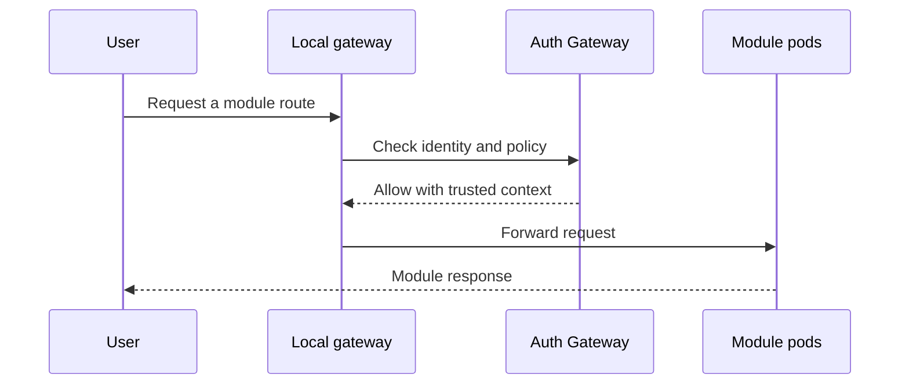

# Run the Full Ecosystem Locally

Run the workspace in a local k3d cluster when you need to exercise routing, identity, events, and multiple services together.

## 1. Prepare the workspace

```bash
mkdir labs64io && cd labs64io
git clone https://github.com/Labs64/labs64.io-workspace.git
cd labs64.io-workspace
just doctor      # checks Docker, k3d, Helm, Helmfile, kubectl and just
just clone       # clones the ecosystem repositories next to the workspace
just up          # creates the k3d cluster, builds the images and deploys the stack
```

The workspace clones every repository as a sibling of `labs64.io-workspace`, so keep it in a folder of its own. The [workspace DevContainer](../development/contributing.md#set-up-the-workspace) bundles every tool `just doctor` checks.

## 2. Confirm the platform is healthy

```bash
kubectl get pods
```

Open `http://gateway.localhost` and the aggregated API documentation at `http://gateway.localhost/swagger-ui`.


```mermaid
sequenceDiagram
  participant U as User
  participant G as Local gateway
  participant A as Auth Gateway
  participant M as Module pods
  U->>G: Request a module route
  G->>A: Check identity and policy
  A-->>G: Allow with trusted context
  G->>M: Forward request
  M-->>U: Module response
```

## 3. Explore a workflow

Use the [Services & Modules](../modules/index.md) area to select a capability. When you are ready to make environment decisions such as storage, ingress, and observability, continue to [Deploy to your Kubernetes cluster](./deploy-to-kubernetes.md).
