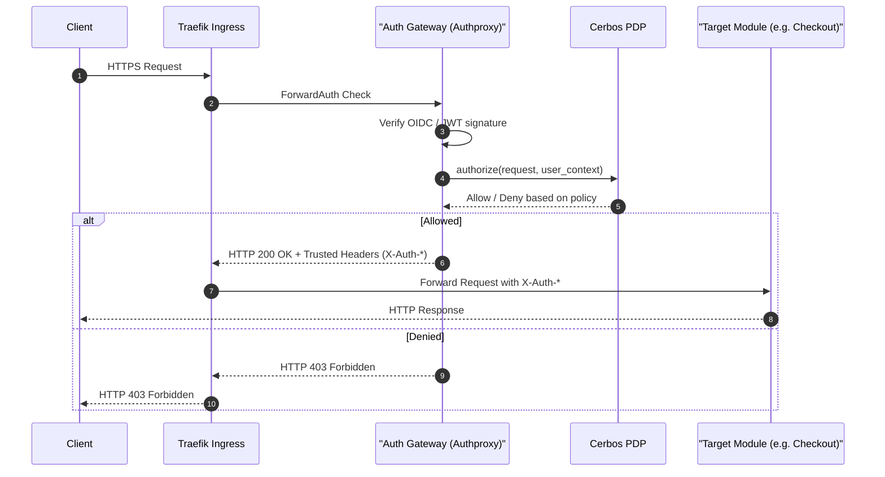
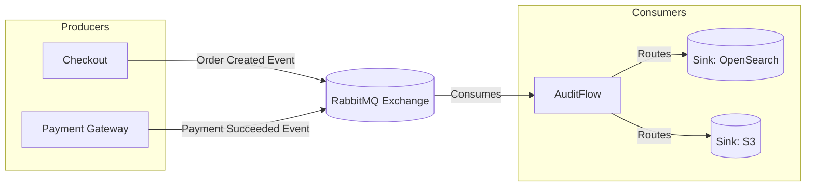
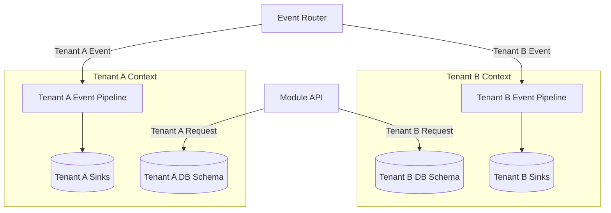
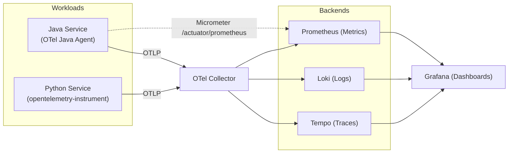
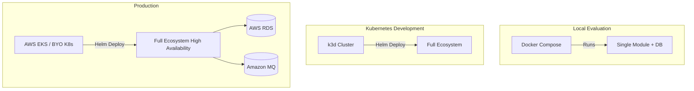

# Architecture Overview

This page outlines the core architectural principles and flows of the Labs64.IO ecosystem. The platform is designed as a set of independent, polyglot microservices deployed behind a unified gateway, adhering to API-first contracts.

## Request Flow

Every request crosses a zero-trust edge before it reaches any application code. Traefik serves as the ingress controller and delegates authentication and authorization to the Auth Gateway (`traefik-authproxy`) and the Cerbos Policy Decision Point (PDP).

On success, the Auth Gateway injects a trusted header contract that all upstream modules rely on:
- `X-Auth-User`
- `X-Auth-Scopes`
- `X-Auth-Tenant`
- `X-Request-ID`

## Event-Driven Architecture

While modules use synchronous REST calls for direct actions (e.g., initiating a payment), asynchronous state changes and audits are propagated via RabbitMQ to AuditFlow.

Modules do not read each other's databases. They communicate either across the gateway or by subscribing to/publishing events.

## Multi-Tenancy

Labs64.IO supports strict tenant isolation, utilizing a database-per-service model for persistent stores and isolated pipelines for events.

Every request and event is tagged with `X-Auth-Tenant`. Events without a tenant context belong to a reserved `_platform` pseudo-tenant to ensure isolation.

## Observability Pipeline

Observability is infrastructure-owned. Services do not carry OpenTelemetry SDKs; instead, runtime auto-instrumentation attaches at deployment.

This ensures zero instrumentation drift between the application code and the telemetry collected.

## Deployment Architecture

Labs64.IO provides flexibility from local testing to production deployments.

See **[Get Started](../getting-started/index.md)** for deployment instructions and **[Operate & Manage](../operate-manage/index.md)** for the production operating model.
