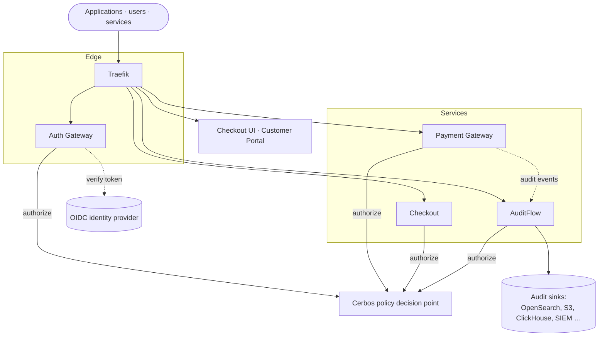
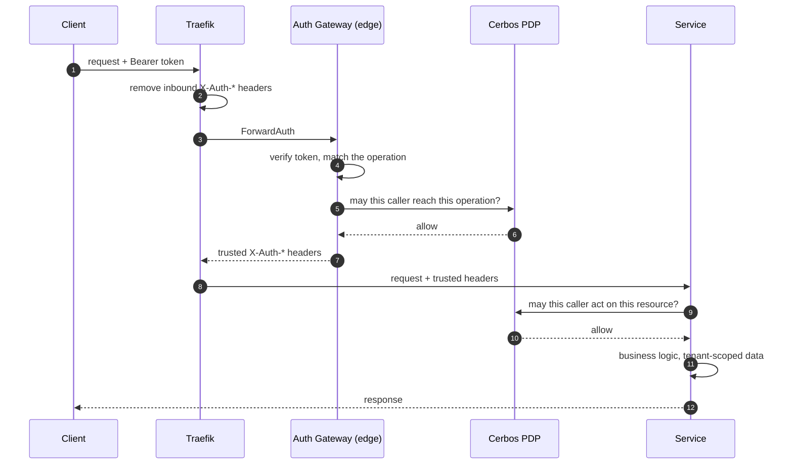
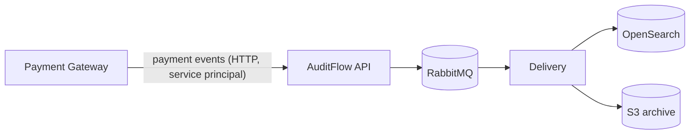
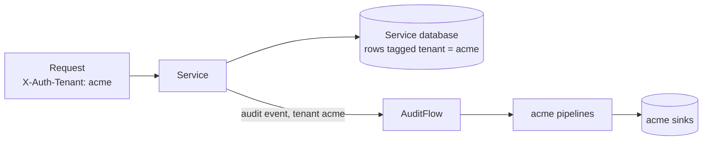
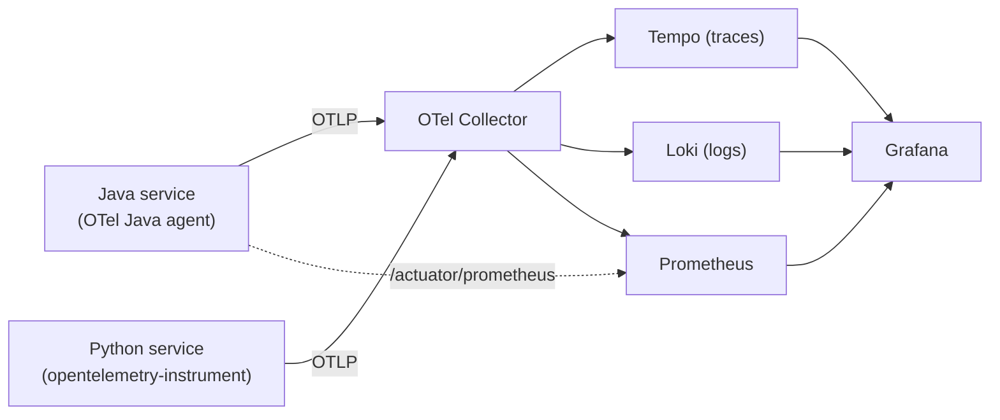
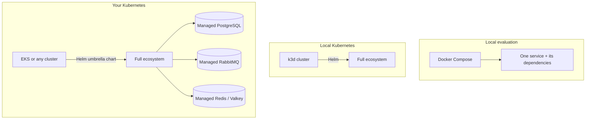

# Architecture Overview

Labs64.IO is a set of independent services behind one authenticated edge. Each service owns its API, its data and its release cycle; the platform supplies what they share: identity and access control, tenant isolation, audit delivery, observability and deployment packaging. You can adopt one service or all of them.

```mermaid
flowchart TB
  client([Applications · users · services])
  subgraph edge["Edge"]
    traefik["Traefik"]
    ag["Auth Gateway"]
  end
  idp[("OIDC identity provider")]
  pdp["Cerbos policy decision point"]
  subgraph modules["Services"]
    pg["Payment Gateway"]
    co["Checkout"]
    af["AuditFlow"]
  end
  ui["Checkout UI · Customer Portal"]
  sinks[("Audit sinks:<br/>OpenSearch, S3, ClickHouse, SIEM …")]

  client --> traefik --> ag
  ag -. verify token .-> idp
  ag -- authorize --> pdp
  traefik --> pg & co & af & ui
  pg -- authorize --> pdp
  co -- authorize --> pdp
  af -- authorize --> pdp
  pg -. audit events .-> af
  af --> sinks
```

## Principles

1. **Authenticate once, at the edge.** Services never see a token, only the identity context the edge issued for the request.
2. **One policy source.** Each service's OpenAPI contract declares who may call which operation; authorization policy and gateway routing are generated from it.
3. **Fail closed.** An invalid token, an unknown route or an unreachable decision point rejects the request.
4. **Every record has a tenant.** Requests, rows and audit events carry the tenant they belong to.
5. **Services own their data.** No service reads another service's database; they integrate through APIs.
6. **Contracts first.** APIs are OpenAPI documents; code is generated from them, and v1 contracts change additively only.
7. **Operations are infrastructure-owned.** Telemetry, secrets and network policy come from the deployment, not from service code.

## Identity and access

Authorization is enforced at more than one point, but decided in one place: every check goes to the same central Cerbos policy decision point (PDP), evaluating the same generated policy.

```mermaid
sequenceDiagram
    autonumber
    participant C as Client
    participant T as Traefik
    participant AG as Auth Gateway (edge)
    participant PDP as Cerbos PDP
    participant M as Service

    C->>T: request + Bearer token
    T->>T: remove inbound X-Auth-* headers
    T->>AG: ForwardAuth
    AG->>AG: verify token, match the operation
    AG->>PDP: may this caller reach this operation?
    PDP-->>AG: allow
    AG-->>T: trusted X-Auth-* headers
    T->>M: request + trusted headers
    M->>PDP: may this caller act on this resource?
    PDP-->>M: allow
    M->>M: business logic, tenant-scoped data
    M-->>C: response
```

| Enforcement point | Where | Decides |
|---|---|---|
| **Edge** | [Auth Gateway](../modules/auth-gateway/index.md) | Is the token valid, and may this caller reach this operation at all? |
| **Domain** | Inside each service, from generated annotations (`@RequireScopes`, `@RequireTenant`, `@Authorize`) | May this caller perform this action on this resource? |
| **Data** | Where a service adopts it (Checkout purchase-order lists) | Which rows may this caller see? The policy is turned into a database query filter. |

**The identity context.** After a successful edge check the service receives four headers, and nothing else about the caller:

| Header | Content |
|---|---|
| `X-Auth-User` | The caller. Service principals are prefixed (`svc:` at the edge, `service:<module>` for internal calls). |
| `X-Auth-Scopes` | The caller's scopes. |
| `X-Auth-Tenant` | The caller's tenant, or `-` for a tenant-less call. |
| `X-Request-ID` | Correlation ID, propagated on every downstream call. |

The contract only grows: services ignore headers they do not know. The shared [Commons](https://github.com/Labs64/labs64.io-commons) libraries parse it for Java and Python, enforce it fail-closed and propagate it on outbound calls.

**Policy from the contract.** Each operation in a service's OpenAPI document carries an `x-labs64.auth` block: required scopes, whether a tenant is required, and the resource type. An operation without it is public. At build time this one block generates the service's annotations, the Cerbos policies and the edge routing manifest, so documentation, routing and policy cannot diverge.

**Service-to-service calls.** A service acting on its own behalf, for example Payment Gateway sending audit events, calls the target service directly inside the cluster as its own service principal (`service:<module>`), with the scopes from its integration configuration and the tenant of the record it is acting on. It never forwards an end user as itself.

**Trust boundary.** Only the edge is reachable from outside. Inside the cluster, services trust the identity headers they receive, so a workload that could reach a service directly could forge them; NetworkPolicies that allow only the edge and named caller services are what prevent this. Cryptographic verification of in-cluster callers (mTLS or workload identity) is not part of the platform.

See [Security and compliance](../operate-manage/security-compliance.md) for the deployment checklist.

## Audit events

Services call each other synchronously over REST. Audit events go to [AuditFlow](../modules/auditflow/index.md) over its HTTP API; AuditFlow buffers them on RabbitMQ and delivers them through the tenant's pipelines to the configured sinks.

```mermaid
flowchart LR
    PG["Payment Gateway"] -->|"payment events (HTTP, service principal)"| API["AuditFlow API"]
    API --> MQ[("RabbitMQ")]
    MQ --> W["Delivery"]
    W --> S1[("OpenSearch")]
    W --> S2[("S3 archive")]
```

AuditFlow is a router, not a store: the sinks are the systems of record.

## Multi-tenancy

The tenant comes from the token and travels as `X-Auth-Tenant`. Each service stores the tenant with every record and scopes every query by it. AuditFlow routes an event only through the pipelines its tenant owns, with a per-tenant quota, credentials and dead-letter queue; tenant-less events belong to the reserved `_platform` tenant.

```mermaid
flowchart LR
    req["Request<br/>X-Auth-Tenant: acme"] --> svc["Service"]
    svc --> db[("Service database<br/>rows tagged tenant = acme")]
    svc -->|"audit event, tenant acme"| af["AuditFlow"]
    af --> pa["acme pipelines"]
    pa --> sa[("acme sinks")]
```

Each service has its own database and credentials. See [Scaling and multi-tenancy](../operate-manage/scaling-multi-tenancy.md).

## Observability

Telemetry is infrastructure-owned. Services carry no OpenTelemetry SDK: the OpenTelemetry Java agent (Java services) and `opentelemetry-instrument` (Python services) attach at deployment when observability is enabled.

```mermaid
flowchart LR
    J["Java service<br/>(OTel Java agent)"] -->|OTLP| COL["OTel Collector"]
    P["Python service<br/>(opentelemetry-instrument)"] -->|OTLP| COL
    J -. "/actuator/prometheus" .-> PROM["Prometheus"]
    COL --> TEMPO["Tempo (traces)"]
    COL --> LOKI["Loki (logs)"]
    COL --> PROM
    TEMPO & LOKI & PROM --> GRAF["Grafana"]
```

See [Monitoring and observability](../operate-manage/monitoring-observability.md).

## Deployment

```mermaid
flowchart TB
    subgraph local["Local evaluation"]
        DC["Docker Compose"] --> M1["One service + its dependencies"]
    end
    subgraph dev["Local Kubernetes"]
        K3D["k3d cluster"] -->|"Helm"| E1["Full ecosystem"]
    end
    subgraph prod["Your Kubernetes"]
        K8S["EKS or any cluster"] -->|"Helm umbrella chart"| E2["Full ecosystem"]
        E2 --> RDS[("Managed PostgreSQL")]
        E2 --> MQ2[("Managed RabbitMQ")]
        E2 --> R2[("Managed Redis / Valkey")]
    end
```

Every service ships as a container image and a Helm chart; the `labs64io-ecosystem` umbrella chart installs them together. See [Get Started](../getting-started/index.md) and [Operate & Manage](../operate-manage/index.md).
