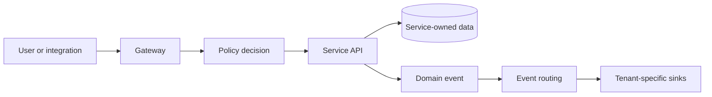

# Core Concepts

The platform is easier to adopt when these ideas are treated as shared conventions rather than service-specific details.

| Concept | Meaning | Why it matters |
|---|---|---|
| **Service** | An independently deployable capability with its own API and responsibility | Teams can adopt and release capabilities independently |
| **Gateway** | The trusted edge for incoming traffic | Authentication and authorization happen before traffic reaches a service |
| **Tenant** | The organization or logical customer context of a request or event | It is the isolation boundary for data, policy, and routing |
| **Policy decision** | An allow/deny decision evaluated from declared policy | Access control stays explicit and reviewable |
| **Event** | An immutable record of something that happened | Services can react without direct database access |
| **Sink** | A destination that receives processed events | Audit and operational data can reach the systems that own it |
| **Contract** | An OpenAPI or event schema agreement | Integrations can be built and tested independently |

## How the concepts connect

## Principles to carry into every integration

1. Send user and tenant context through the trusted gateway rather than inventing a parallel identity path.
2. Integrate through documented APIs and events; do not read another service's data store.
3. Treat secrets and policy as deployment configuration, never source code.
4. Build observability into the deployment from the first environment.

For the topology behind these concepts, see [Architecture Overview](./architecture.md).
