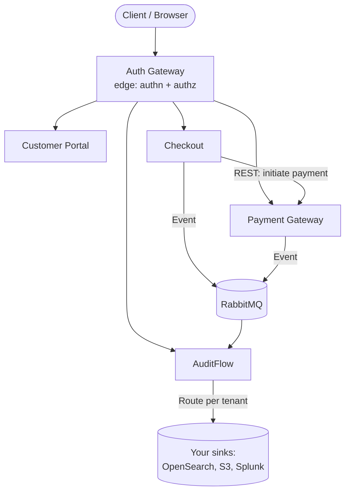

# Labs64.IO Documentation

Welcome to the **Labs64.IO** documentation. This portal provides everything you need to **deploy, configure, integrate, and operate** the Labs64.IO modular digital commerce platform.

Labs64.IO is designed for developers, DevOps engineers, and solution architects. You can adopt a single module to solve an immediate problem, or deploy the entire ecosystem behind a shared authenticated gateway.

## Ecosystem Overview

Every request enters through the Auth Gateway. Modules communicate with each other exclusively through REST calls across the gateway or asynchronously via events on RabbitMQ. No module connects directly to another module's database.

## How to Use This Documentation

This documentation is organized around your journey from evaluation to production:

- **[Getting Started](./getting-started/)**: Step-by-step guides for deploying Labs64.IO via Docker, local Kubernetes, or Helm.
- **[Modules](./modules/)**: Detailed configuration, integration, and operational guides for every module.
- **[Reference](./reference/)**: API specs, configuration tables, and event schemas.
- **[Development](./development/)**: Links to the Workspace for contributors.

If you want to get something running right now, head straight to **[Getting Started](./getting-started/)**.
