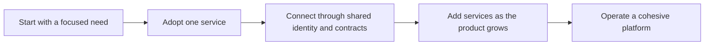

# What is Labs64.IO?

Labs64.IO is a modular platform for teams building and operating digital commerce products. It gives product and platform teams reusable building blocks for identity, authorization, payments, checkout, auditability, and customer-facing experiences—without requiring every team to recreate the platform foundations.

## Why it exists

Modern commerce systems become difficult to change when authentication, payments, audit trails, and customer experiences are designed as one large application. Labs64.IO separates those concerns into deployable services with explicit APIs, events, and ownership boundaries.

| Challenge | Labs64.IO approach | Result |
|---|---|---|
| Repeated gateway and identity work | Shared authenticated edge and policy decisions | One consistent security boundary |
| Provider-specific payment integrations | A dedicated payment integration boundary | Product teams integrate once |
| Missing auditability | Events routed to durable, searchable sinks | Traceability across services |
| Coupled release cycles | Independent services and database ownership | Adopt and evolve capabilities incrementally |

## Who it is for

| Role | What this documentation helps you do |
|---|---|
| Product or integration engineer | Discover contracts and connect a capability |
| Platform engineer | Deploy services with shared conventions |
| Security or compliance lead | Understand policy enforcement, tenant context, and audit paths |
| Operations team | Scale, monitor, troubleshoot, and upgrade the platform |

## Build progressively

You can begin with one capability—such as AuditFlow—and add further services when the use case is ready. The common edge, event conventions, and operating model reduce the work of joining services later.

Next: learn the [core concepts](./core-concepts.md), or choose a [deployment path](../getting-started/choose-a-deployment-path.md).
