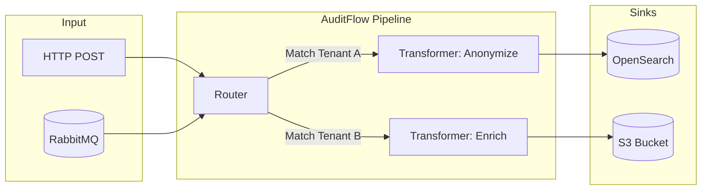

# AuditFlow

## Overview
AuditFlow is a central router for audit events. It allows you to publish events once from any service and route them to multiple destinations (sinks) based on configurable, tenant-isolated pipelines. AuditFlow is stateless—it does not store events itself, but ensures they reach the configured persistent stores.

## Capabilities

| Capability | Description |
|------------|-------------|
| **Tenant Isolation** | Every pipeline belongs to exactly one tenant. Events route only through their respective tenant's pipelines. |
| **Pluggable Sinks** | Out-of-the-box support for OpenSearch, S3, Splunk, and more. |
| **Pluggable Transformers** | Modify or enrich event payloads in-flight before they reach a sink. |
| **Stateless Routing** | Relies entirely on external persistence; it operates purely as an event processor. |

## Architecture

AuditFlow consumes events from RabbitMQ (or via direct API), passes them through a tenant's pipeline (which may include transformers), and sends them to sinks.



## Quick Start

Run AuditFlow independently using Docker Compose:

```bash
git clone https://github.com/Labs64/labs64.io-auditflow.git
cd labs64.io-auditflow
just up
```

Test it by publishing an event:
```bash
curl -sS -i -X POST http://localhost:8080/audit/publish \
  -H 'Content-Type: application/json' \
  -d '{"eventType":"demo.event","sourceSystem":"demo","extra":{"hello":"world"}}'
```

## Configuration

Configuration is provided via environment variables or Helm values.

| Variable | Description | Default |
|----------|-------------|---------|
| `SPRING_RABBITMQ_HOST` | RabbitMQ broker host. | `localhost` |
| `SPRING_RABBITMQ_USERNAME` | RabbitMQ user. | `guest` |
| `SPRING_RABBITMQ_PASSWORD` | RabbitMQ password. | `guest` |
| `AUDITFLOW_PIPELINE_PATH` | Path to the directory containing tenant pipelines. | `/etc/auditflow/tenants` |

### Pipeline Configuration Example

Tenants configure their pipelines via YAML files (e.g., `tenants/tenant1.yaml`):

```yaml
tenantId: "tenant1"
pipelines:
  - name: "Store in OpenSearch"
    condition: "eventType == 'demo.event'"
    sinks:
      - type: "opensearch"
        properties:
          index: "audit-logs"
```

## REST APIs

AuditFlow primarily consumes events from RabbitMQ, but also provides an API to publish directly or manage configurations.

| Endpoint | Method | Description |
|----------|--------|-------------|
| `/audit/publish` | `POST` | Publish a single event synchronously. |
| `/actuator/health`| `GET` | Health check endpoint. |

## Events

AuditFlow listens to the shared RabbitMQ exchange for all ecosystem events.

| Event Property | Required | Description |
|----------------|----------|-------------|
| `eventId` | Yes | Unique UUID for the event. |
| `eventType` | Yes | Dot-separated action name (e.g., `user.login`). |
| `tenantId` | No | Target tenant. If omitted, routes to `_platform`. |

## Examples

### Custom Transformer Plugin

Create a transformer to mask sensitive data (`transformers/mask.py`):

```python
def transform(input_data: dict) -> dict:
    if "email" in input_data.get("payload", {}):
        input_data["payload"]["email"] = "***@***.com"
    return input_data
```

## Operations

AuditFlow is designed to be horizontally scaled. Increase the `replicaCount` in your Helm chart to process more events concurrently. The underlying RabbitMQ queues will automatically distribute messages across the replicas.

## Troubleshooting

| Symptom | Cause | Resolution |
|---------|-------|------------|
| Events not reaching sink | Pipeline condition mismatch | Verify the `eventType` and `tenantId` match the pipeline definition. |
| Python plugin crash | Syntax error in plugin | Check the AuditFlow logs for Python tracebacks. Ensure the plugin implements the correct method signature. |
| RabbitMQ connection error | Bad credentials or network | Verify `SPRING_RABBITMQ_*` environment variables. |
