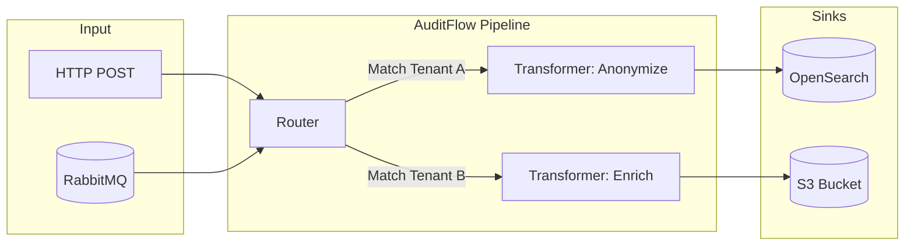

# AuditFlow

## Overview
AuditFlow is a central router for audit events. It allows you to publish events once from any service and route them to multiple destinations (sinks) based on configurable, tenant-isolated pipelines. AuditFlow is stateless—it does not store events itself, but ensures they reach the configured persistent stores.

## Capabilities

| Capability | Description |
|------------|-------------|
| **Tenant Isolation** | Every pipeline belongs to exactly one tenant. Events route only through their respective tenant's pipelines. |
| **Pluggable Sinks** | Send events to the destinations configured for a tenant. |
| **Pluggable Transformers** | Modify or enrich event payloads in-flight before they reach a sink. |
| **Stateless Routing** | Relies entirely on external persistence; it operates purely as an event processor. |

## Architecture

AuditFlow consumes events from RabbitMQ (or via direct API), passes them through a tenant's pipeline (which may include transformers), and sends them to sinks.



## Quick Start

Run AuditFlow independently using Docker Compose:

```bash
git clone https://github.com/Labs64/labs64.io-auditflow.git
cd labs64.io-auditflow
just up
```

Test it by publishing an event:
```bash
curl -sS -i -X POST http://localhost:8080/audit/publish \
  -H 'Content-Type: application/json' \
  -d '{"eventType":"demo.event","sourceSystem":"demo","extra":{"hello":"world"}}'
```

## Configuration

Configuration is provided via environment variables or Helm values.

| Variable | Description | Default |
|----------|-------------|---------|
| `SPRING_RABBITMQ_HOST` | RabbitMQ broker host. | `localhost` |
| `SPRING_RABBITMQ_USERNAME` | RabbitMQ user. | `guest` |
| `SPRING_RABBITMQ_PASSWORD` | RabbitMQ password. | `guest` |
| `AUDITFLOW_PIPELINE_PATH` | Path to the directory containing tenant pipelines. | `/etc/auditflow/tenants` |

### Pipeline Configuration Example

Tenants configure their pipelines via YAML files (e.g., `tenants/tenant1.yaml`):

```yaml
tenantId: "tenant1"
pipelines:
  - name: "Store in OpenSearch"
    condition: "eventType == 'demo.event'"
    sinks:
      - type: "opensearch"
        properties:
          index: "audit-logs"
```

### Transformers and sinks

Build every pipeline from a small set of explicit stages. The configured set depends on the deployment; validate a plugin's supported interface in the service repository before enabling it.

| Category | Purpose | Typical use |
|---|---|---|
| **Transformers: privacy** | Remove, mask, or pseudonymize fields | Keep personal data out of a downstream audit index |
| **Transformers: enrichment** | Add context derived from known event fields | Attach source or classification metadata |
| **Transformers: normalization** | Reshape event data into a common form | Make events easier to query consistently |
| **Sinks: search** | Write records for investigation and querying | OpenSearch |
| **Sinks: object storage** | Store durable archive copies | S3-compatible storage |
| **Sinks: observability / SIEM** | Send events to security or operations tooling | Splunk and equivalent configured adapters |
| **Sinks: analytics** | Store events for aggregation and dashboards | ClickHouse |

Order matters: apply privacy transformations before a sink that should never receive the original field. Keep sink credentials in deployment secrets, not in pipeline files.

#### ClickHouse

The ClickHouse sink targets analytics workloads — aggregations by tenant, event type and time
window. Pair `clickhouse_sink` with the `audit_clickhouse` transformer: the transformer flattens
the canonical event into one row whose keys are the table's column names, and the sink is pure
transport. Pairing the sink with `zero` instead will fail every delivery.

Create the database and table before enabling the pipeline; the sink never runs DDL.

```sql
CREATE DATABASE IF NOT EXISTS audit;

CREATE TABLE IF NOT EXISTS audit.audit_events
(
    timestamp        DateTime64(3, 'UTC'),
    event_time       DateTime64(3, 'UTC'),
    event_id         UUID,
    correlation_id   String,

    event_type       LowCardinality(String),
    source_system    LowCardinality(String),
    tenant_id        LowCardinality(String),

    action_name      LowCardinality(String),
    action_status    LowCardinality(String),
    action_message   String,
    user_id          String,

    geo_lat          Nullable(Float64),
    geo_lon          Nullable(Float64),
    geo_country_code LowCardinality(String),
    geo_country      LowCardinality(String),
    geo_region       LowCardinality(String),
    geo_city         LowCardinality(String),

    extra            Map(LowCardinality(String), String)
)
ENGINE = MergeTree
PARTITION BY toYYYYMM(timestamp)
ORDER BY (tenant_id, event_type, timestamp)
TTL toDateTime(timestamp) + INTERVAL 365 DAY;
```

`ORDER BY` leads with `tenant_id` because every dashboard query is tenant-scoped first. Tune
`PARTITION BY` and `TTL` to your retention policy — the values above are illustrative.

```yaml
pipelines:
  - name: analytics
    enabled: true
    transformer:
      name: audit_clickhouse
    sink:
      name: clickhouse_sink
      properties:
        service-url: http://clickhouse:8123
        database: audit
        table: audit_events
        username: auditflow
        password: ${secretRef:clickhouse-password}
```

**Insert batching.** AuditFlow delivers one event per request, and row-at-a-time inserts into
MergeTree create one part per row. The sink relies on ClickHouse's server-side `async_insert` to
batch them, with `wait_for_async_insert=1` so a successful delivery means the row is durably
written and the retry/DLQ chain stays meaningful. This costs up to `async-insert-busy-timeout-ms`
of latency per delivery. Never set `wait-for-async-insert: false` to buy that latency back — it
makes the sink acknowledge events it may still lose.

Because every delivery blocks until its own flush, **the rows a flush can collect are bounded by
how many deliveries are in flight at once, not by how long the window is.** Measured against
ClickHouse 25.3, the largest flush always equalled the delivery concurrency. So the lever for
fewer parts is more concurrent delivery (more sink replicas, more consumer concurrency) — a longer
window only makes each caller wait longer, which lowers throughput and starves the very buffer it
was meant to fill. At 32 concurrent deliveries a 1000 ms window measured worse on every axis than
the 200 ms default: 24.7 vs 31.5 rows per flush, 24 vs 18 new parts, and 1016 ms vs 198 ms p50
delivery latency.

| Property | Default | Notes |
|---|---|---|
| `async-insert-busy-timeout-ms` | `200` | ClickHouse aliases this to `async_insert_busy_timeout_max_ms` — it sets the **max** of the window, not the window. Keep `timeout` (default 10s) comfortably above it. |
| `async-insert-use-adaptive-busy-timeout` | `true` | Since ClickHouse 24.2 the window floats between the min and the max based on ingest rate. Leaving it on keeps latency low when events are sparse. Set `false` to pin the window at the max: worth ~5.1 → 7.9 rows per flush and 52 → 35 parts *if* deliveries are genuinely concurrent, but it costs ~3.4× p50 latency if they are not. |
| `async-insert-busy-timeout-min-ms` | ClickHouse's `50` | Lower bound of the adaptive window; has no effect once the adaptive timeout is off. |

`async_insert_max_data_size` and `async_insert_max_query_number` are not exposed: both are ceilings
that can only flush a batch *earlier*, and neither is the binding constraint here — an audit row is
~473 bytes against a 10 MiB default, and ClickHouse only honours the query-number limit when
`async_insert_deduplicate` is enabled.

**Duplicates.** DLQ replay can re-deliver an event, and `MergeTree` will store it twice.
AuditFlow's `eventId` deduplication (~24h) absorbs the common case. For stricter guarantees use
`ReplacingMergeTree ORDER BY (tenant_id, event_type, timestamp, event_id)`, noting that it
deduplicates only within a partition and only after merge, so queries must then use `FINAL`.

## REST APIs

AuditFlow primarily consumes events from RabbitMQ, but also provides an API to publish directly or manage configurations.

| Endpoint | Method | Description |
|----------|--------|-------------|
| `/audit/publish` | `POST` | Publish a single event synchronously. |
| `/actuator/health`| `GET` | Health check endpoint. |

## Events

AuditFlow listens to the shared RabbitMQ exchange for all ecosystem events.

| Event Property | Required | Description |
|----------------|----------|-------------|
| `eventId` | Yes | Unique UUID for the event. |
| `eventType` | Yes | Dot-separated action name (e.g., `user.login`). |
| `tenantId` | No | Target tenant. If omitted, routes to `_platform`. |

## Examples

### Custom Transformer Plugin

Create a transformer to mask sensitive data (`transformers/mask.py`):

```python
def transform(input_data: dict) -> dict:
    if "email" in input_data.get("payload", {}):
        input_data["payload"]["email"] = "***@***.com"
    return input_data
```

## Operations

AuditFlow is designed to be horizontally scaled. Increase the `replicaCount` in your Helm chart to process more events concurrently. The underlying RabbitMQ queues will automatically distribute messages across the replicas.

## Troubleshooting

| Symptom | Cause | Resolution |
|---------|-------|------------|
| Events not reaching sink | Pipeline condition mismatch | Verify the `eventType` and `tenantId` match the pipeline definition. |
| Python plugin crash | Syntax error in plugin | Check the AuditFlow logs for Python tracebacks. Ensure the plugin implements the correct method signature. |
| RabbitMQ connection error | Bad credentials or network | Verify `SPRING_RABBITMQ_*` environment variables. |
