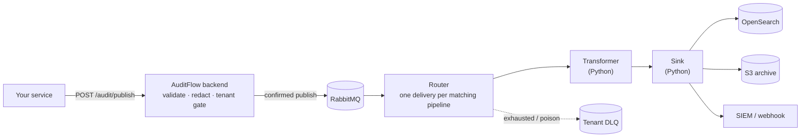

# AuditFlow

AuditFlow captures audit events from your services and delivers them, with sensitive fields removed at the door, to wherever they need to live: a search index, cold storage, a SIEM, or several of these at once. A service publishes an event with one REST call; routing is YAML configuration per tenant. AuditFlow handles buffering, redaction, deduplication, retries and fan-out.

AuditFlow is a router, not a system of record. It has no database of its own: the [sinks](./sinks-and-transformers.md) you configure (OpenSearch, ClickHouse, S3, Splunk, …) own persistence, retention and query.

## When it fits

- You need a reliable answer to "who did what, when, and from where" across many services, and each service solves it differently today.
- Events must reach more than one destination: a search index for operations, an archive for compliance, an alert channel for security.
- Sensitive fields such as user IDs, e-mail addresses or session tokens must never reach log storage.
- Losing an audit event is a compliance failure, not a gap in a graph.

AuditFlow complements OpenTelemetry rather than replacing it:

| | Observability (OpenTelemetry) | AuditFlow |
|---|---|---|
| Question answered | *Is my system healthy?* | *Who did what, when, with what outcome?* |
| Consumer | SREs and platform engineers | Compliance, security, legal, auditors |
| Data | High volume, sampled, short retention | Every event matters, lossless, long retention |

It is not the right tool for distributed tracing, metrics or infrastructure logs, or for intercepting raw HTTP traffic at a proxy: your services decide what to publish.

## Usage scenarios

| Scenario | How AuditFlow handles it |
|---|---|
| **Compliance audit trail** (GDPR, SOC 2, ISO 27001, HIPAA) | Redact personal data at ingest, then fan out to OpenSearch for search and S3 for immutable archival. |
| **Security alerting and SIEM** | A conditional pipeline sends only `security.*` events to Splunk or a webhook; routine events go to cheaper storage. Retries ride out a SIEM outage. |
| **Multi-tenant SaaS audit logs** | Each tenant owns its pipelines, quota and sink credentials; events never cross tenants. |
| **Central audit hub** | Every service publishes to one endpoint; routing logic lives in one place instead of in each service. |

## Key capabilities

| Capability | What you get |
|---|---|
| **Pipelines as configuration** | Routing, transformation and destinations are per-tenant YAML, picked up live without a restart. |
| **Condition routing** | Field-level rules on any event field, nested `all`/`any` groups, 19 operators. |
| **Fan-out** | One event, many independent pipelines; a failing destination never delays or duplicates the others. |
| **Ingest-time redaction** | Mask, keyed-hash or drop fields before the event reaches the broker. |
| **Confirmed publish** | `/audit/publish` answers `200` only after the broker has durably stored the event. |
| **Retries and dead-lettering** | Per-pipeline retries over hours, then a tenant-scoped dead-letter queue you can inspect, replay or purge. |
| **Idempotency** | Duplicate `eventId`s are suppressed, so publishers can retry safely. |
| **Tenant isolation** | Per-tenant pipelines, rate limit, in-flight cap, secrets and DLQ. |
| **Batching** | Publish up to 100 events per call; sinks can write a batch in one request. |
| **Tamper evidence** | The S3 sink can write a signed, hash-chained digest per object. |
| **15 built-in sinks** | Plus your own Python sink or transformer, loaded at runtime. |

## How it works


```mermaid
flowchart LR
    P["Your service"] -->|"POST /audit/publish"| BE["AuditFlow backend<br/>validate · redact · tenant gate"]
    BE -->|"confirmed publish"| MQ[("RabbitMQ")]
    MQ --> R["Router<br/>one delivery per matching pipeline"]
    R --> T["Transformer<br/>(Python)"]
    T --> S["Sink<br/>(Python)"]
    S --> D1[("OpenSearch")]
    S --> D2[("S3 archive")]
    S --> D3["SIEM / webhook"]
    R -. "exhausted / poison" .-> DLQ[("Tenant DLQ")]
```

AuditFlow runs as three services:

| Service | Stack | Role |
|---|---|---|
| `auditflow-be` | Java, Spring Boot | REST API, redaction, tenant gate, routing and delivery |
| `auditflow-transformer` | Python, FastAPI | Runs transformer modules (`POST /transform/{name}`) |
| `auditflow-sink` | Python, FastAPI | Runs sink modules (`POST /sink/{name}`) |

1. The backend validates the event, assigns the server `timestamp`, applies redaction and checks the tenant (provisioned, enabled, within quota).
2. It publishes the event to RabbitMQ and waits for the broker's confirm before answering.
3. The router evaluates every enabled pipeline of the event's tenant and creates one delivery per match.
4. Each delivery runs its transformer and sink. Failures are retried with growing delays; exhausted or malformed deliveries go to the tenant's DLQ.

## Start here

Run AuditFlow on its own with Docker Compose (Docker, Compose v2 and [`just`](https://github.com/casey/just) required):

```bash
git clone https://github.com/Labs64/labs64.io-auditflow.git
cd labs64.io-auditflow
just up          # backend, transformer, sink, RabbitMQ, Valkey, Cerbos, ClickHouse
```

Publish an event and watch it arrive:

```bash
curl -sS -i -X POST http://localhost:8080/audit/publish \
  -H 'Content-Type: application/json' \
  -d '{"eventType":"user.login","sourceSystem":"auth-service","tenantId":"demo",
       "extra":{"userId":"alice","ip":"203.0.113.7"}}'

just log sink    # look for the delivered event
just ch-events   # the same event, stored in ClickHouse
```

| URL | Purpose |
|---|---|
| `http://localhost:8080/swagger-ui.html` | Interactive REST API |
| `http://localhost:8081/docs`, `http://localhost:8082/docs` | Transformer and sink APIs, module registry |
| `http://localhost:15673` | RabbitMQ management UI |

`just up obs` adds the observability stack (OpenTelemetry Collector, Tempo, Loki, Prometheus, Grafana at `http://localhost:3000` with a pre-provisioned AuditFlow dashboard). To run AuditFlow with the rest of the ecosystem, see [Run the full ecosystem locally](../../getting-started/run-the-full-ecosystem-locally.md).

## API contract

The contract is `auditflow-api/src/main/resources/openapi/openapi-audit-v1.yaml` in the [AuditFlow repository](https://github.com/Labs64/labs64.io-auditflow). Through the gateway the paths are prefixed with `/auditflow/api/v1`.

| Operation | Method and path | Scope |
|---|---|---|
| Publish one event | `POST /audit/publish` | `audit-event:write` |
| Publish up to 100 events | `POST /audit/publish/batch` | `audit-event:write` |

| Status | Meaning |
|---|---|
| `200` | The broker stored the event; it will be routed. |
| `400` | The event is invalid. |
| `403` | `TENANT_NOT_PROVISIONED` or `TENANT_DISABLED`. |
| `429` | `TENANT_RATE_LIMITED`; retry after `Retry-After`, keeping the same `eventId`. |
| `503` | The broker could not confirm; retry with the same `eventId`. |

A batch answers with one `ACCEPTED`/`REJECTED` result per event, so one bad event never blocks the others.

**Compatibility.** v1 is additive-only: new paths, fields and enum values may appear, nothing is removed or narrowed. CI rejects any change that would break a v1 client.

### The event

`AuditEvent` requires only `eventType` and `sourceSystem`. `tenantId` selects the tenant's pipelines (through the gateway it comes from your token, not the body); events without a tenant belong to the reserved `_platform` tenant. `eventId` makes retries safe. `timestamp` is assigned by the server; the business time of the action goes in `eventTime`.

Everything else your domain needs goes in `extra`, an open map:

- **No key is required**, and keys AuditFlow does not know are delivered unchanged.
- **Absent stays absent**: a missing key is omitted, never filled with a placeholder such as `"unknown"`.
- **Convention keys** `userId`, `actionName`, `actionStatus`, `actionMessage`, `sessionId`, `durationMs` and `responseStatus` are promoted by the bundled transformers into dedicated fields and columns. You can promote your own keys too; see [Sinks and transformers](./sinks-and-transformers.md#promote-your-own-extra-keys).

## Configure

| Topic | Where |
|---|---|
| Tenants, pipelines, conditions, retries, batching, quotas | [Pipelines and tenants](./pipelines.md) |
| Redaction of sensitive fields | [Pipelines and tenants: redaction](./pipelines.md#redaction) |
| Sink and transformer catalogue, ClickHouse | [Sinks and transformers](./sinks-and-transformers.md) |
| Kubernetes values | The `auditflow` chart in [labs64.io-helm-charts](https://github.com/Labs64/labs64.io-helm-charts/tree/master/charts/auditflow) |

## Extend

Sinks and transformers are plain Python modules loaded at runtime. Mount your own into `sinks_bootstrap/` or `transformers_bootstrap/` (a volume or ConfigMap on Kubernetes) and reference it by file name in a pipeline. No backend change and no image rebuild. See [Sinks and transformers: write your own](./sinks-and-transformers.md#write-your-own).

## Operate

**Delivery guarantees.**

- A delivery that fails is retried after 5 s, 30 s, 2 min, 10 min, 30 min, 1 h, then every 3 h, until it succeeds, the pipeline's `retry.maxAttempts` is used up, or `retry.maxAge` (default 24 h) has passed.
- Throttling (rate limit, in-flight cap, full bulkhead) defers a delivery without spending an attempt.
- Poison deliveries (a 4xx from a sink, malformed transformer output) are dead-lettered at once instead of retried.
- Circuit breakers guard every transformer and sink call; shutdown drains in-flight work.

**Dead-letter queue.** Every tenant has its own DLQ, one entry per failed pipeline with the reason and last error. The actuator endpoint `/actuator/dlq/<tenantId>` is the operator surface:

| Method | Effect |
|---|---|
| `GET` | Counts by pipeline and reason. Does not change the queue. |
| `POST` | Replays the tenant's entries, optionally for one `pipeline`. |
| `DELETE` | Purges entries, optionally for one `pipeline`. **Irreversible.** |

Only that tenant's messages are touched; there is no un-scoped DLQ operation.

**Pipeline inspection.** `GET /actuator/pipelines/<tenantId>` lists the deployed pipelines with their effective retry and batch settings and any warnings. `POST /actuator/pipelines/<tenantId>/dry-run` evaluates events (or an inline tenant document) against the pipelines without delivering anything.

**Infrastructure.**

| Component | Role | Managed alternatives |
|---|---|---|
| RabbitMQ 4.x | Buffering, retry delays, dead-lettering. Standard AMQP only, no plugins. Kafka is not supported. | Amazon MQ for RabbitMQ, CloudAMQP |
| Redis or Valkey | Idempotency keys and, with several replicas, the shared rate limit. Not storage. | ElastiCache, Azure Cache for Redis, Memorystore |

A single replica can run without Redis (`auditflow.idempotency.store: memory`, `tenants.ratelimit.backend: in-memory`, plus excluding Spring's Redis auto-configuration). More than one replica needs Redis, or each replica enforces its own quota.

**Observability.** Traces, logs and metrics come from runtime auto-instrumentation (see [Monitoring and observability](../../operate-manage/monitoring-observability.md)). The `auditflow.tenant.events{tenant,provider,outcome}` counter tracks routed, delivered, quarantined and rejected events per tenant.

## Before you go live

- [ ] Every tenant that publishes has a tenant document; unknown tenants are rejected with `403`.
- [ ] Redaction rules cover every field that must not reach a sink. A `hash` rule needs `AUDITFLOW_REDACTION_HASH_KEY` from a secret.
- [ ] Sink credentials are `${secretRef:<key>}` references, never literals in pipeline files.
- [ ] More than one backend replica runs with Redis for idempotency and rate limiting.
- [ ] Someone owns the DLQ: there is no automatic expiry, and a purge cannot be undone.
- [ ] On Kubernetes with NetworkPolicy enabled, sinks on ports other than 443 have a matching `networkPolicy.extraEgress` rule.

## Troubleshooting

| Symptom | Likely cause | What to do |
|---|---|---|
| `403 TENANT_NOT_PROVISIONED` | No tenant document for the token's tenant | Add the tenant file or ConfigMap; it is picked up live. |
| Event accepted but nothing delivered | No pipeline condition matched | Use the pipeline dry run against the event. |
| Deliveries pile up in the DLQ | Sink unreachable or rejecting | Check `GET /actuator/dlq/<tenantId>` reasons, fix the sink, then replay. |
| A sink module is missing from `GET /registry` | The module failed to import | Check the sink or transformer service log for the import error. |

## Next steps

- [Pipelines and tenants](./pipelines.md)
- [Sinks and transformers](./sinks-and-transformers.md)
- [Architecture overview](../../introduction/architecture.md)
