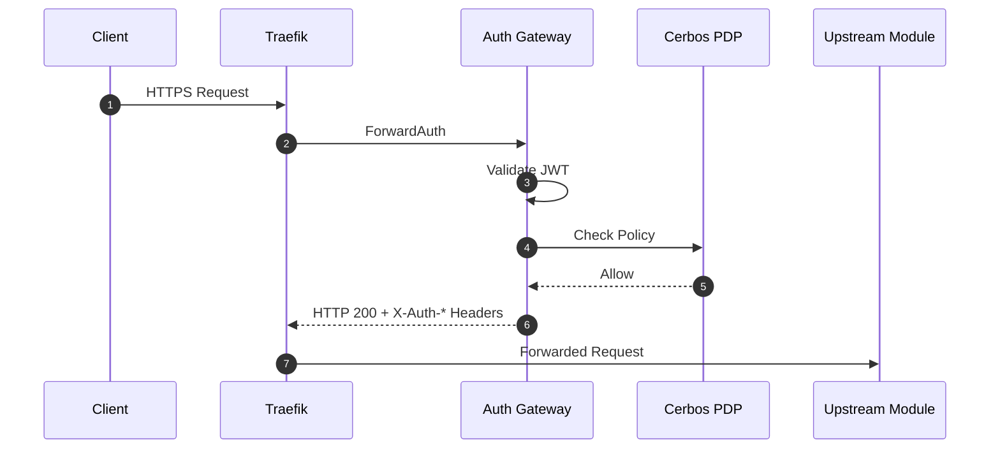

# Auth Gateway

## Overview
The Auth Gateway (`traefik-authproxy`) provides the authenticated edge for the entire Labs64.IO ecosystem. It enforces authentication via OIDC/JWT and delegates authorization decisions to the Cerbos Policy Decision Point (PDP) before requests reach any module.

## Capabilities

| Capability | Description |
|------------|-------------|
| **Centralized Authentication** | Validates JWTs from identity providers (e.g., Keycloak, Auth0). |
| **Centralized Authorization** | Queries Cerbos for policy-as-code evaluation. |
| **Trusted Header Injection** | Passes validated context (`X-Auth-User`, etc.) to upstream modules. |
| **Fail Closed** | Rejects unmapped or unauthorized routes explicitly. |

## Architecture

Auth Gateway leverages Traefik's `ForwardAuth` middleware.



## Quick Start

Auth Gateway is automatically started in the Kubernetes deployment. 
To test, make an unauthenticated request to the Checkout API:
```bash
curl -i http://gateway.localhost/checkout/api/v1/orders
```
*Expected: HTTP 403 Forbidden.*

## Configuration

| Variable | Description | Default |
|----------|-------------|---------|
| `AUTH_JWKS_URL` | The URL to fetch the public keys for JWT validation. | - |
| `AUTH_CERBOS_ADDRESS` | The gRPC address of the Cerbos PDP. | `cerbos:3593` |
| `AUTH_ALLOWED_ISSUERS`| Comma-separated list of valid token issuers. | - |

## REST APIs

The Auth Gateway does not expose business APIs. It exposes a single endpoint used by Traefik:

| Endpoint | Method | Description |
|----------|--------|-------------|
| `/verify` | `GET` | The ForwardAuth target for Traefik. |

## Events

The Auth Gateway does not publish domain events to RabbitMQ.

## Examples

### Upstream Trusted Headers

When a request is allowed, the Auth Gateway injects these headers:
- `X-Auth-User: usr_123`
- `X-Auth-Scopes: read:orders write:orders`
- `X-Auth-Tenant: tnt_abc`

## Operations

Auth Gateway is stateless and can be aggressively scaled. It must be deployed alongside a Cerbos PDP sidecar or connected to a highly available Cerbos cluster.

## Troubleshooting

| Symptom | Cause | Resolution |
|---------|-------|------------|
| Valid tokens rejected (403) | Cerbos policy mismatch | Verify the Cerbos policies mapped to the endpoint. Check Cerbos logs. |
| JWT validation fails | Incorrect JWKS URL | Ensure `AUTH_JWKS_URL` is accessible from the Auth Gateway pod. |
