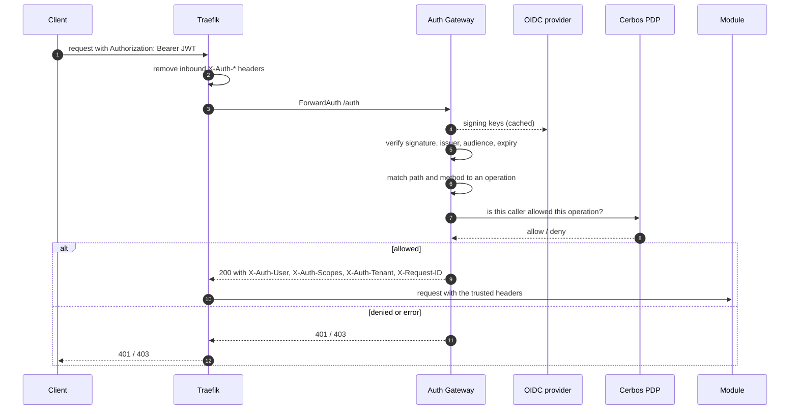

# Auth Gateway

The Auth Gateway is the authenticated edge of the Labs64.IO Ecosystem. Every external request passes through it before it reaches a module. It verifies the caller's token, asks the central policy decision point whether the operation is allowed, and hands the module a trusted identity context instead of the token. Modules never validate tokens themselves.

It is the `traefik-authproxy` service, deployed with Traefik and the shared gateway middlewares by the `api-gateway` Helm chart.

## Key capabilities

| Capability | What you get |
|---|---|
| Token verification | RS256 JWTs from any OIDC provider, for example Keycloak or Auth0, with signing keys from the provider's discovery document, cached and refreshed on rotation. |
| Per-operation authorization | The gateway matches each request to an operation of a module's OpenAPI contract, and the Cerbos policy decision point authorizes it. |
| Trusted identity headers | Allowed requests reach the module with `X-Auth-User`, `X-Auth-Scopes`, `X-Auth-Tenant` and `X-Request-ID` set by the gateway. |
| Header-smuggling protection | Traefik removes client-supplied `X-Auth-*` headers on every route, public ones included, before anything else runs. |
| Fail closed | An invalid token, an unknown route or an unreachable decision point rejects the request. |
| Rate limiting | A Traefik rate-limit middleware runs on every protected route. |
| Hot reload | Route manifests reload without a restart. |

## How it works


```mermaid
sequenceDiagram
    autonumber
    participant C as Client
    participant T as Traefik
    participant AG as Auth Gateway
    participant IdP as OIDC provider
    participant PDP as Cerbos PDP
    participant M as Module

    C->>T: request with Authorization: Bearer JWT
    T->>T: remove inbound X-Auth-* headers
    T->>AG: ForwardAuth /auth
    AG-->>IdP: signing keys (cached)
    AG->>AG: verify signature, issuer, audience, expiry
    AG->>AG: match path and method to an operation
    AG->>PDP: is this caller allowed this operation?
    PDP-->>AG: allow / deny
    alt allowed
        AG-->>T: 200 with X-Auth-User, X-Auth-Scopes, X-Auth-Tenant, X-Request-ID
        T->>M: request with the trusted headers
    else denied or error
        AG-->>T: 401 / 403
        T-->>C: 401 / 403
    end
```

**Route matching.** Each module's OpenAPI contract declares, per operation, whether it is public and which scopes and tenant it needs (`x-labs64.auth`). At build time this produces a routes manifest per module and the matching Cerbos policies, so the gateway's routing and the policy cannot drift from the documented API. The gateway loads the manifests from `ROUTES_DIR`. Paths without an OpenAPI contract, such as UI bundles, use static prefix rules from `STATIC_ROUTES_FILE`. The gateway consults them only when no operation matches, and rejects a request that matches nothing.

**The decision.** For a matched operation the gateway sends Cerbos one check. The resource kind is `<module>_api` (for example `payment_gateway_api`), the action is the operation ID, and the caller's scopes and tenant are attributes. The gateway treats a caller whose ID starts with `svc:` as a service principal.

**The identity context.** All four headers are set on every allowed response, empty when not applicable, so Traefik always overwrites anything a client sent. The gateway restricts values to `[a-zA-Z0-9_.:-]`. `X-Auth-Tenant` is `-` for a tenant-less call. The gateway echoes a well-formed `X-Request-ID` and otherwise generates a UUIDv7.

Scopes are the union of the token's `scope` claim and Keycloak-style role claims (`TOKEN_SCOPES_CLAIM_PATHS`). The tenant comes from the `tenant` claim (`TOKEN_TENANT_CLAIM_PATH`).

## Start here

The gateway is part of every Kubernetes deployment of the ecosystem; see [Deploy to Kubernetes](../../getting-started/deploy-to-kubernetes.md). Locally, `just up` in the workspace brings it up with a mock OIDC provider. The gateway rejects an unauthenticated call to a protected operation:

```bash
curl -i http://gateway.localhost/payment-gateway/api/v1/payments
# HTTP/1.1 401 Unauthorized
```

## API

The gateway exposes no business API. Its own endpoints:

| Endpoint | Purpose |
|---|---|
| `GET/POST /auth` | ForwardAuth target called by Traefik |
| `GET /health` | Liveness |
| `GET /health/ready` | Readiness: `503` until at least one module's routes are loaded |
| `POST /reload` | Re-read the route manifests and static rules |

## Configure

| Variable | Default | Description |
|---|---|---|
| `OIDC_URL` | `http://mock-oidc.tools.svc.cluster.local:8080` | OIDC provider base URL |
| `OIDC_REALM` | `default` | Realm name |
| `OIDC_DISCOVERY_URL` | `{OIDC_URL}/realms/{OIDC_REALM}/.well-known/openid-configuration` | Discovery document; may be an in-cluster URL |
| `OIDC_ISSUER` | the discovery document's `issuer` | Expected `iss` claim; set it when the public issuer differs from the discovery URL |
| `OIDC_AUDIENCE` | `account` | Expected `aud` claim |
| `TOKEN_SCOPES_CLAIM_PATHS` | `scope,realm_access.roles,resource_access.{audience}.roles` | Claim paths the scopes are read from |
| `TOKEN_TENANT_CLAIM_PATH` | `tenant` | Claim path of the tenant |
| `CERBOS_URL` | `http://localhost:3592` | Cerbos PDP HTTP endpoint |
| `ROUTES_DIR` | `routes` | Directory of generated `<module>.routes.yaml` manifests |
| `STATIC_ROUTES_FILE` | `static_routes.yaml` | Static prefix rules for non-OpenAPI surfaces |
| `JWKS_CACHE_TTL` | `3600` | Signing-key cache lifetime in seconds |
| `LOG_LEVEL` | `INFO` | Log level |

With the Helm chart, `rateLimit.average` and `rateLimit.burst` in the `api-gateway` chart values set the rate limit.

## Operate

- The gateway is stateless; scale it horizontally. Run the Cerbos PDP (`authz-pdp` chart) with at least two replicas. If it is unreachable, the gateway denies every protected request.
- The gateway logs every decision on `traefik_authproxy` as `authz outcome=enforced-<allow|deny> … requestId=<id>`, at INFO for an allow and WARN for a deny or error. Only the `traefik_authproxy.authz.detail` logger records user, tenant and scopes, at DEBUG. Keep it off in shared environments.

## Before you go live

- [ ] Point `OIDC_*` at your production identity provider and set `OIDC_ISSUER` explicitly.
- [ ] Modules are reachable only through the gateway. A workload inside the cluster that can reach a module directly can forge `X-Auth-*` headers; NetworkPolicies prevent that.
- [ ] The Cerbos PDP runs highly available.

## Troubleshooting

| Symptom | Likely cause | What to do |
|---|---|---|
| Every call returns `401` | Issuer or audience mismatch | Compare the token's `iss`/`aud` with `OIDC_ISSUER` and `OIDC_AUDIENCE`. |
| `403` for a valid token | Missing scope, or no route matched | Check the WARN `authz` log line for the operation and decision; raise the detail logger temporarily. |
| Gateway pod not ready | No route manifests loaded | Check that the module routes ConfigMaps are mounted at `ROUTES_DIR`. |

## Next steps

- [Architecture overview: identity and access](../../introduction/architecture.md#identity-and-access)
- [Security and compliance](../../operate-manage/security-compliance.md)
