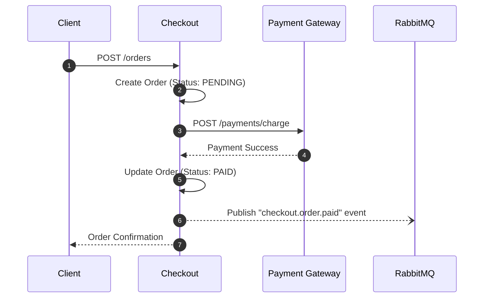

# Checkout

## Overview
The Checkout module provides a whitelabel, drop-in workflow for converting carts into paid orders. It handles the state machine for an order lifecycle and interfaces seamlessly with the Payment Gateway.

## Capabilities

| Capability | Description |
|------------|-------------|
| **Order State Machine** | Manages states from `CREATED` to `PAID`, `FAILED`, or `REFUNDED`. |
| **Payment Orchestration** | Communicates with the Payment Gateway to initiate transactions. |
| **Event Emission** | Publishes state changes to RabbitMQ for AuditFlow and other modules. |

## Architecture

Checkout sits behind the Auth Gateway and accepts REST calls to initiate an order. It then synchronously calls the Payment Gateway and asynchronously fires events.



## Quick Start

If you are running the ecosystem via Kubernetes (`just up` in the workspace repository), the Checkout module is automatically deployed.

Test it by creating an order:
```bash
curl -sS -i -X POST http://gateway.localhost/checkout/api/v1/orders \
  -H "Authorization: Bearer <TOKEN>" \
  -H "Content-Type: application/json" \
  -d '{"items":[{"id":"item1","quantity":1}],"currency":"USD"}'
```

## Configuration

| Variable | Description | Default |
|----------|-------------|---------|
| `PAYMENT_GATEWAY_URL` | Base URL of the internal Payment Gateway. | `http://payment-gateway:8080` |
| `SPRING_DATASOURCE_URL` | PostgreSQL connection string. | (Provided by Helm) |

## REST APIs

| Endpoint | Method | Description |
|----------|--------|-------------|
| `/api/v1/orders` | `POST` | Create a new order. |
| `/api/v1/orders/{id}` | `GET` | Retrieve order details. |
| `/api/v1/orders/{id}/cancel` | `POST` | Cancel a pending order. |

## Events

| Event Type | Description |
|------------|-------------|
| `checkout.order.created` | Emitted when an order is first created. |
| `checkout.order.paid` | Emitted when payment is successfully captured. |
| `checkout.order.cancelled` | Emitted when an order is manually cancelled. |

## Examples

### Creating an Order via API

```json
POST /api/v1/orders
{
  "customerRef": "cust_12345",
  "items": [
    {
      "sku": "PROD-A",
      "price": 1000,
      "quantity": 2
    }
  ],
  "currency": "USD"
}
```

## Operations

Checkout requires a PostgreSQL database to maintain order state. Ensure the database is backed up regularly and monitor the connection pool metrics via Grafana.

## Troubleshooting

| Symptom | Cause | Resolution |
|---------|-------|------------|
| Payment initiation fails | Payment Gateway unreachable | Verify the `PAYMENT_GATEWAY_URL` is correct and the PG pod is running. |
| Orders stuck in PENDING | Missing webhook or async response | Ensure the Payment Gateway is correctly emitting success events back to the message bus or webhook endpoint. |
