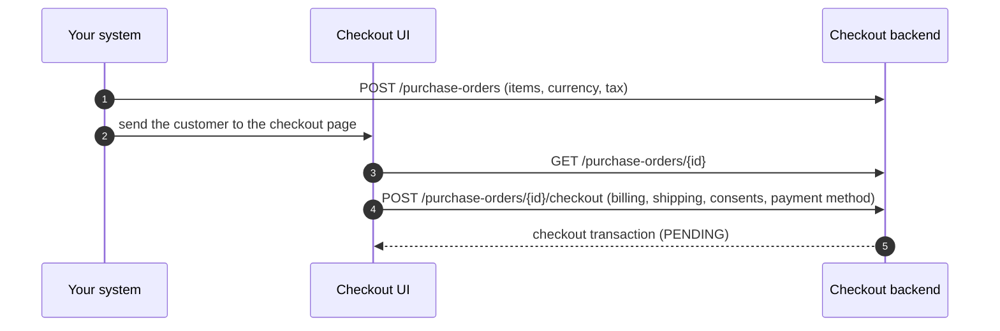

# Checkout

Checkout is a white-label checkout. It has a backend that manages purchase orders and customers and records checkout transactions, and a brandable web UI on top of it. A purchase order describes what you sell: items, prices, currency, tax and an optional sales window. A customer checks it out with billing and shipping details and the required consents, and that creates a checkout transaction.

The repository ships two services:

| Service | Stack | Role |
|---|---|---|
| `checkout-be` | Java, Spring Boot | REST API for purchase orders, customers and checkout transactions |
| `checkout-fe` | Vue 3, Vite, Pinia | White-label checkout UI |

## Key capabilities

| Capability | What you get |
|---|---|
| Purchase orders | Items, currency, tax (fixed or percentage) and extras. The backend validates them on write, and an optional time range limits when the order can be checked out. |
| Customers | Customer records you can attach to purchase orders. |
| Checkout | `POST /purchase-orders/{id}/checkout` takes billing and shipping details, consents and the payment method, and records a checkout transaction. |
| Tenant isolation | Every record belongs to the caller's tenant, taken from the trusted gateway context. |
| Policy-filtered lists | The central authorization policy filters purchase-order lists, so a caller sees only the orders the policy allows. |
| Runtime branding | The UI reads its configuration from a mounted `env.json` at runtime, so one image serves many brands. |

## How it works


```mermaid
sequenceDiagram
    autonumber
    participant S as Your system
    participant UI as Checkout UI
    participant BE as Checkout backend

    S->>BE: POST /purchase-orders (items, currency, tax)
    S->>UI: send the customer to the checkout page
    UI->>BE: GET /purchase-orders/{id}
    UI->>BE: POST /purchase-orders/{id}/checkout (billing, shipping, consents, payment method)
    BE-->>UI: checkout transaction (PENDING)
```

A checkout transaction is `PENDING`, `COMPLETED`, `FAILED` or `CANCELED`. Checkout does not call the Payment Gateway. Settle the payment with the [Payment Gateway](../payment-gateway/index.md) from your own system. Checkout needs no message broker.

## Start here

Checkout is part of the full ecosystem deployment; see [Run the full ecosystem locally](../../getting-started/run-the-full-ecosystem-locally.md). To run it on its own:

```bash
git clone https://github.com/Labs64/labs64.io-checkout.git
cd labs64.io-checkout/checkout-be && just dev-up    # backend + PostgreSQL, Swagger at :8080/swagger-ui.html
cd ../checkout-fe && just dev-up                     # UI at :5173
```

## API contract

The contract is `checkout-be/src/main/resources/openapi/openapi-checkout-v1.yaml` in the [Checkout repository](https://github.com/Labs64/labs64.io-checkout). Through the gateway the paths are prefixed with `/checkout/api/v1`.

| Operation | Method and path | Scope |
|---|---|---|
| List / create customers | `GET`, `POST /customers` | `customer:read` / `customer:write` |
| Read / update a customer | `GET`, `PATCH /customers/{id}` | `customer:read` / `customer:write` |
| List / create purchase orders | `GET`, `POST /purchase-orders` | `purchase-order:read` / `purchase-order:write` |
| Read / update a purchase order | `GET`, `PATCH /purchase-orders/{id}` | `purchase-order:read` / `purchase-order:write` |
| Check out | `POST /purchase-orders/{id}/checkout` | `purchase-order:checkout` |
| List / read checkout transactions | `GET /checkout-transactions[/{id}]` | `checkout-transaction:read` |

Every operation requires a tenant. Errors carry a `code` such as `VALIDATION_ERROR`, `CONFLICT` or `CONSENT_REQUIRED`.

## Configure

- **Backend.** The backend connects to PostgreSQL through the standard Spring datasource settings. With the Helm chart, these settings come from the platform database and a Kubernetes Secret.
- **UI.** The UI reads its runtime configuration from `env.json`, mounted as a ConfigMap on Kubernetes (default path `/config/env.json`).
- **Kubernetes.** The `checkout` chart in [labs64.io-helm-charts](https://github.com/Labs64/labs64.io-helm-charts/tree/master/charts/checkout) deploys both services. `ui.enabled` switches the UI on.

## Next steps

- [Payment Gateway](../payment-gateway/index.md)
- [Customer Portal](../customer-portal/index.md)
