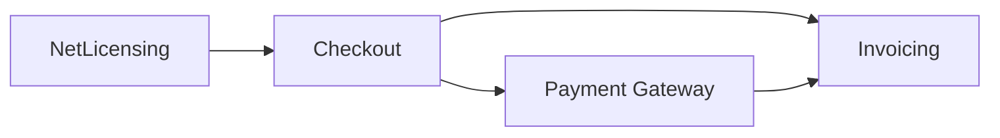

# Commerce & Billing

These services cover the lifecycle from entitlement and purchasing through payment and invoicing. Each owns its domain data and integrates through explicit contracts.

| Service | Role | Availability |
|---|---|---|
| [NetLicensing](./netlicensing/index.md) | Manages products, licenses, and entitlement checks | Planned |
| [Payment Gateway](./payment-gateway/index.md) | Normalizes payment-provider interactions | Available |
| [Checkout](./checkout/index.md) | Orchestrates buyer-facing order and payment flows | Available |
| [Invoicing](./invoicing/index.md) | Produces invoices and manages billing documents | Planned |

The diagram shows the intended commerce flow. Planned services are not callable contracts until released.
