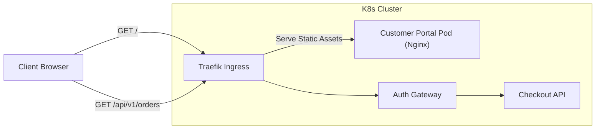

# Customer Portal

## Overview
The Customer Portal is a self-service, white-labelled frontend for end users. It allows customers to view their order history, manage payment methods, and update their profile.

## Capabilities

| Capability | Description |
|------------|-------------|
| **Order Management** | View past orders and current statuses. |
| **Profile Management** | Update user details and preferences. |
| **Responsive Design** | Built with Vue 3 and Bootstrap 5 for mobile and desktop. |

## Architecture

The Customer Portal is a Single Page Application (SPA) served by Nginx. It communicates via REST to the Labs64.IO APIs through the Auth Gateway.



## Quick Start

The portal is accessible in the local Kubernetes deployment at:
- **URL:** `http://portal.localhost`

## Configuration

Because the portal is a compiled Vue application, runtime configuration is injected via a `config.json` file served by Nginx at startup.

| Variable | Description | Default |
|----------|-------------|---------|
| `VITE_API_BASE_URL` | The base URL for backend API calls. | `/api` |
| `VITE_THEME_COLOR` | The primary brand color (hex). | `#0055ff` |

## REST APIs

The Customer Portal is a client, not a server. It does not expose REST APIs.

## Events

The Customer Portal does not publish events directly to RabbitMQ.

## Examples

### Injecting Configuration via ConfigMap

```yaml
apiVersion: v1
kind: ConfigMap
metadata:
  name: customer-portal-config
data:
  config.json: |
    {
      "apiBaseUrl": "https://api.labs64.io",
      "themeColor": "#ff0000"
    }
```

## Operations

The Customer Portal is packaged as static assets within an Nginx Alpine container. It is highly cacheable. In production, consider placing a CDN (like CloudFront or Cloudflare) in front of the Ingress to serve the static assets.

## Troubleshooting

| Symptom | Cause | Resolution |
|---------|-------|------------|
| Blank page on load | API CORS issues | Ensure the API gateway is configured to allow origins from the portal domain. |
| Routing 404s on refresh | Nginx misconfiguration | The Nginx container is pre-configured for SPA routing (`try_files $uri /index.html`). If overwritten, ensure this rule is restored. |
