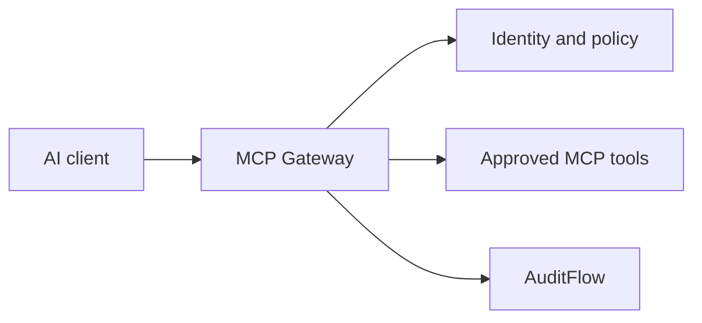

# MCP Gateway

> **Planned service**
>
> MCP Gateway is documented as the intended design for early adopters. It is not yet available as a deployable service or API contract.

MCP Gateway will provide a controlled boundary between AI clients and tools exposed through the [Model Context Protocol (MCP)](https://modelcontextprotocol.io/). It is designed to make tool access discoverable, tenant-aware, observable, and policy-governed.

## Intended capabilities

| Capability | Intended behavior |
|---|---|
| Tool registry | Register and discover approved MCP servers and tools |
| Identity propagation | Carry authenticated user and tenant context to tool execution |
| Policy enforcement | Evaluate which caller may discover or invoke each tool |
| Audit trail | Emit records of tool discovery and invocation |
| Integration adapters | Connect MCP clients to Labs64.IO services and external tools |

## Design ahead

Plan tool boundaries around least privilege: define each tool's input and output, identify the tenant context it needs, and decide which calls should be auditable. Do not depend on endpoint names, authentication details, or SDKs until the published API reference is available.
