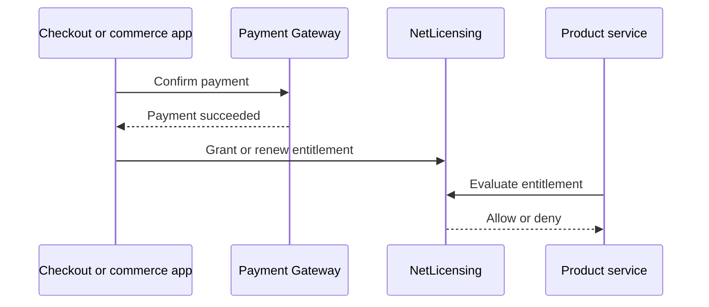

# NetLicensing

> **Planned integration**
>
> This page describes the intended Labs64.IO integration model. NetLicensing is not yet shipped as a Labs64.IO service contract.

NetLicensing will provide license and entitlement management for products that need to grant, validate, renew, and revoke access. It is intended to let product services ask one consistent question: *is this customer entitled to use this capability now?*

| Area | Intended behavior |
|---|---|
| Product catalog | Define licensable products, features, and plans |
| Entitlements | Issue and evaluate time-bound or usage-bound rights |
| Lifecycle | Support activation, renewal, suspension, and revocation |
| Commerce connection | Accept the business outcome of a completed purchase |
| Auditability | Emit significant entitlement changes for traceability |

## Intended flow

Use this page for solution design only. Contract fields, event names, and endpoints will be published with the release.
