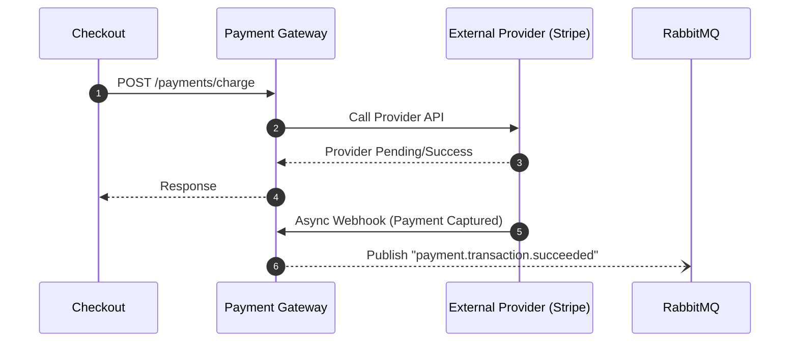

# Payment Gateway

## Overview
The Payment Gateway module unifies multiple Payment Service Providers (PSPs) behind a single, consistent API. It abstractions away the complexities of integrating with Stripe, PayPal, or custom providers.

## Capabilities

| Capability | Description |
|------------|-------------|
| **Multi-Provider Support** | Stripe, PayPal, and Adyen out-of-the-box. |
| **Provider Abstraction** | A single `POST /payments/charge` API handles all providers. |
| **Webhook Normalization** | Converts provider-specific webhooks into standard Labs64.IO events. |

## Architecture

The Payment Gateway receives synchronous calls from the Checkout module and communicates asynchronously with external PSPs, often receiving webhooks to finalize state.



## Quick Start

The Payment Gateway is automatically deployed as part of the full ecosystem. To test it, use the Checkout module to initiate a purchase, which will automatically call the Payment Gateway.

## Configuration

PSPs are configured via environment variables and Kubernetes secrets.

| Variable | Description | Default |
|----------|-------------|---------|
| `PAYMENT_PROVIDER_ACTIVE` | The active PSP (e.g., `stripe`, `paypal`). | `mock` |
| `PAYMENT_STRIPE_SECRET_KEY`| The secret key for the Stripe provider. | - |
| `SPRING_DATASOURCE_URL` | PostgreSQL connection string. | (Provided by Helm) |

## REST APIs

| Endpoint | Method | Description |
|----------|--------|-------------|
| `/api/v1/payments/charge` | `POST` | Initiate a payment charge. |
| `/api/v1/payments/refund` | `POST` | Refund a previous charge. |
| `/api/v1/webhooks/{provider}`| `POST` | Ingress for external PSP webhooks. |

## Events

| Event Type | Description |
|------------|-------------|
| `payment.transaction.succeeded` | Emitted when a charge is captured. |
| `payment.transaction.failed` | Emitted when a charge is declined. |
| `payment.refund.processed` | Emitted when a refund completes. |

## Examples

### Charging a Card

```json
POST /api/v1/payments/charge
{
  "amount": 1000,
  "currency": "USD",
  "paymentMethod": "pm_card_visa",
  "orderRef": "ord_123"
}
```

## Operations

The Payment Gateway stores transaction logs and mapping data between internal IDs and provider IDs. A PostgreSQL database is required. Because this module handles sensitive payment orchestration, ensure NetworkPolicies restrict egress only to authorized PSP domains.

## Troubleshooting

| Symptom | Cause | Resolution |
|---------|-------|------------|
| Charge fails with 500 | Bad PSP Credentials | Verify `PAYMENT_<PROVIDER>_SECRET_KEY` in your Kubernetes Secrets. |
| Webhook not updating state | Ingress misconfigured | Ensure external PSPs can reach the `/api/v1/webhooks/{provider}` endpoint over the public internet. |
