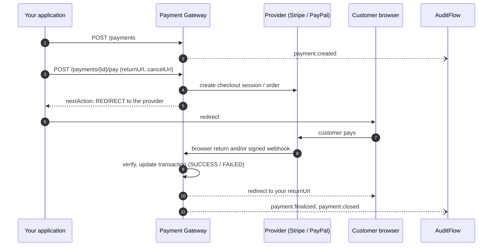

# Payment Gateway

The Payment Gateway puts several payment service providers (PSPs) behind one API. Your application creates a payment, the gateway runs the checkout with the provider the tenant has activated, processes the provider's webhooks and keeps a transaction history, independently of which PSP handled it. Provider-specific code stays inside one module per PSP.

Shipped providers: **Stripe**, **PayPal** and **NoOp** (a test provider that always succeeds).

## Key capabilities

| Capability | What you get |
|---|---|
| **One payment API** | Create, pay, inspect and close payments the same way for every provider. |
| **Hosted checkout** | `pay` returns a redirect to the provider's hosted checkout; the gateway handles the return, cancel and webhook callbacks. |
| **Verified webhooks** | Each provider verifies the PSP signature before a webhook can change a transaction. |
| **Safe concurrency** | A browser return and a webhook arriving together are handled once: transactions update under a database lock, and a terminal state is never overwritten. |
| **Idempotent pay** | `POST /payments/{id}/pay` with an `Idempotency-Key` header can be retried without a second PSP call. |
| **Per-tenant providers** | Each tenant activates the providers it uses and stores its own PSP credentials. |
| **Audit events** | Payment lifecycle events go to [AuditFlow](../auditflow/index.md). |
| **Pluggable providers** | New PSPs implement a small provider SPI; the gateway core needs no change. |

## How it works

### Resource model

| Resource | Owner | What it is |
|---|---|---|
| **Payment definition** | The deployment | Which providers the deployment offers, with their currencies, countries and recurring support. Public and read-only. |
| **Payment provider** | A tenant | The tenant's activation of one definition: an `active` flag and the PSP configuration (credentials, webhook secrets). |
| **Payment** | A tenant | What is being paid. Status `READY`, `INCOMPLETE`, `PAUSED` or `CLOSED`; type `ONE_TIME` or `RECURRING`. |
| **Payment transaction** | A tenant | One attempt to pay with a provider. `PENDING`, then `SUCCESS` or `FAILED`. A retry is a new transaction. |

A provider's configuration is returned only when you read that one provider and hold the `payment-provider:write` scope. Lists never include it.

### Paying

```mermaid
sequenceDiagram
    autonumber
    participant A as Your application
    participant PG as Payment Gateway
    participant PSP as Provider (Stripe / PayPal)
    participant B as Customer browser
    participant AF as AuditFlow

    A->>PG: POST /payments
    PG--)AF: payment.created
    A->>PG: POST /payments/{id}/pay (returnUrl, cancelUrl)
    PG->>PSP: create checkout session / order
    PG-->>A: nextAction: REDIRECT to the provider
    A->>B: redirect
    B->>PSP: customer pays
    PSP->>PG: browser return and/or signed webhook
    PG->>PG: verify, update transaction (SUCCESS / FAILED)
    PG-->>B: redirect to your returnUrl
    PG--)AF: payment.finalized, payment.closed
```

### Provider modules

Each PSP is a separate module implementing the provider SPI (`payment-gateway-providers/providers-spi`): payment execution, plus checkout and webhook support where the PSP has them. Providers present at build time register themselves automatically, and the gateway ships as a single image containing them. Adding a provider means adding a module and rebuilding; no gateway code changes.

## Start here

The gateway is part of the full ecosystem deployment; see [Run the full ecosystem locally](../../getting-started/run-the-full-ecosystem-locally.md). To exercise it without a real PSP, activate the `noop` provider for your tenant and run a payment through it. The repository has a [NoOp flow notebook and a Stripe/PayPal demo runbook](https://github.com/Labs64/labs64.io-payment-gateway/tree/master/examples).

For a real PSP, follow [Stripe](./stripe.md) or [PayPal](./paypal.md).

## API contract

The contract is `payment-gateway-api/src/main/resources/openapi/openapi-payment-gateway-v1.yaml` in the [Payment Gateway repository](https://github.com/Labs64/labs64.io-payment-gateway); validated Java models are published as `io.labs64:payment-gateway-api`. Through the gateway the paths are prefixed with `/payment-gateway/api/v1`.

| Operation | Method and path | Scope |
|---|---|---|
| List payment definitions | `GET /payment-definitions` | public |
| List / create tenant providers | `GET`, `POST /payment-providers` | `payment-provider:read` / `:write` |
| Read (with config), update, delete a provider | `GET`, `PATCH`, `DELETE /payment-providers/{id}` | `payment-provider:write` |
| List / create payments | `GET`, `POST /payments` | `payment:read` / `payment:write` |
| Read a payment | `GET /payments/{id}` | `payment:read` |
| Pay | `POST /payments/{id}/pay` | `payment:pay` |
| Close | `POST /payments/{id}/close` | `payment:write` |
| List / read transactions | `GET /payment-transactions[/{id}]` | `payment-transaction:read` |
| Checkout confirmation | `GET /checkout-sessions/{sessionId}/confirmation` | public |
| PSP callbacks | `/providers/{provider}/checkout-sessions/{sessionId}/return`, `/cancel`, `/providers/{provider}/webhooks` | public, verified by the provider |

Errors use one shape with a `code` such as `VALIDATION_ERROR`, `PSP_ERROR`, `IDEMPOTENCY_CONFLICT` or `PAYMENT_NOT_PAYABLE`.

## Configure

**Payment definitions** are deployment configuration of the gateway service (`payment-definitions` in its application configuration): one entry per offered provider, with `enabled`, display `name` and `description`, `recurring`, `supported-currencies` and `supported-countries`.

**Tenant providers** are created through the API. The `config` object holds the PSP-specific fields; see [Stripe](./stripe.md#provider-configuration) and [PayPal](./paypal.md#provider-configuration).

**Audit events** to AuditFlow are off by default:

| Variable | Default | Description |
|---|---|---|
| `AUDITFLOW_ENABLED` | `false` | Publish `payment.created`, `payment.finalized` and `payment.closed` |
| `AUDITFLOW_URL` | | AuditFlow base URL (in-cluster service) |
| `AUDITFLOW_SOURCE_SYSTEM` | the application name | `sourceSystem` of the events |
| `AUDITFLOW_RETRY_MAX_ATTEMPTS` | `3` | Delivery attempts per event |

The gateway calls AuditFlow as the service principal `service:payment-gateway` with scope `audit-event:write`, carrying the tenant of the payment.

**Infrastructure.** PostgreSQL stores payments, transactions and providers; Redis stores idempotency records. With the Helm chart both come from the platform services; see the `payment-gateway` chart in [labs64.io-helm-charts](https://github.com/Labs64/labs64.io-helm-charts/tree/master/charts/payment-gateway).

## Extend

To add a PSP, create a module under `payment-gateway-providers/<name>/` implementing `PaymentProvider` from the provider SPI, plus `ProviderCheckoutSupport` and `ProviderWebhookSupport` where the PSP offers hosted checkout and webhooks. The provider must verify webhook authenticity itself before returning a result. Use the `noop`, `stripe` and `paypal` modules as references.

## Before you go live

- [ ] The PSP webhook endpoints (`/providers/{provider}/webhooks`) and the browser return and cancel paths are reachable from the internet over HTTPS, and nothing else is exposed publicly.
- [ ] Each provider's webhook secret or webhook ID is set; without it webhooks are rejected.
- [ ] The `noop` definition is disabled in production: it accepts every payment.
- [ ] PSP credentials live only in the tenant provider configuration and are never committed.
- [ ] NetworkPolicy egress allows the PSP APIs your providers call, and nothing more.

## Next steps

- [Stripe](./stripe.md)
- [PayPal](./paypal.md)
- [Checkout](../checkout/index.md)
