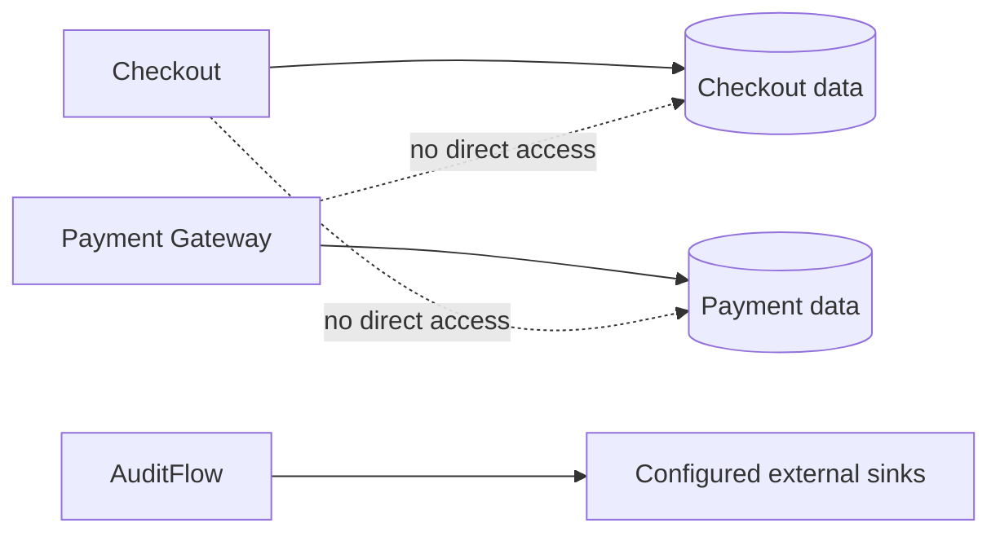

# Databases & Persistence

Labs64.IO follows a database-per-service model. A service may own a separate database or a separately controlled logical database/schema, but it never treats another service's store as an integration API.

| Responsibility | Operational expectation |
|---|---|
| Ownership | One service team owns migrations, access, and retention for its data |
| Credentials | Use distinct, least-privilege credentials per service |
| Backup | Test restore procedures against the recovery objective, not just backup success |
| Encryption | Encrypt in transit and at rest using your platform standard |
| Retention | Define retention and deletion policies for transactional and audit data |
| Upgrade | Run schema migration checks as a release step |

For event routing, remember that AuditFlow's durability is determined by its configured sinks. Size and protect those sinks according to the audit retention requirement.
