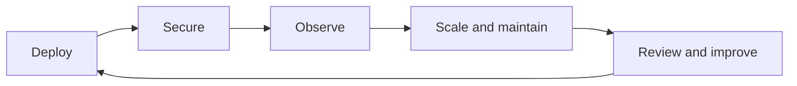

# Operate & Manage

This section is for the platform team responsible for a dependable Labs64.IO environment: DevOps engineers, SREs, administrators, and security owners.

## Operating model

| Need | Start here |
|---|---|
| Select an ownership and support model | [Deployment Tiers](./deployment-tiers.md) |
| Install and configure charts | [Kubernetes & Helm Setup](./kubernetes-helm-setup.md) |
| Expose services safely | [Traefik Gateway Routing](./traefik-gateway-routing.md) |
| Plan resilience and tenancy | [Databases & Persistence](./databases-persistence.md) · [Scaling & Multi-Tenancy](./scaling-multi-tenancy.md) |
| Detect and resolve problems | [Monitoring & Observability](./monitoring-observability.md) · [Troubleshooting](./troubleshooting.md) |

Treat the production checks in this section as deployment responsibilities: they protect customer data, payment workflows, and the integrity of your audit trail.
