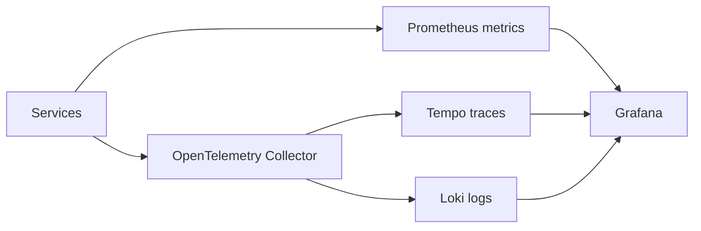

# Monitoring & Observability

Operate the platform with correlated metrics, logs, and traces. The deployment supplies telemetry collection so services can use a consistent pipeline.

## What to monitor

| Signal | Questions it answers | Alert examples |
|---|---|---|
| Availability | Can callers reach the service? | Failed health checks, high 5xx rate |
| Latency | Is a user flow slowing down? | Sustained high p95/p99 latency |
| Saturation | Is capacity close to a limit? | CPU, memory, connection, or queue thresholds |
| Event flow | Are events being processed and delivered? | Queue growth, sink failures, processing lag |
| Security edge | Are requests unexpectedly denied or failing validation? | Auth failures, policy denials, webhook verification failures |

## Minimum dashboard set

1. Gateway request rate, latency, and status codes.
2. One service-health view per deployed service.
3. RabbitMQ queue depth and consumer health for event-driven flows.
4. Database health, connections, and backup status for each stateful service.
5. Sink delivery success and lag for AuditFlow pipelines.

Use `X-Request-ID` and the trusted tenant context carefully to correlate an incident without exposing sensitive data in broad-access dashboards.
