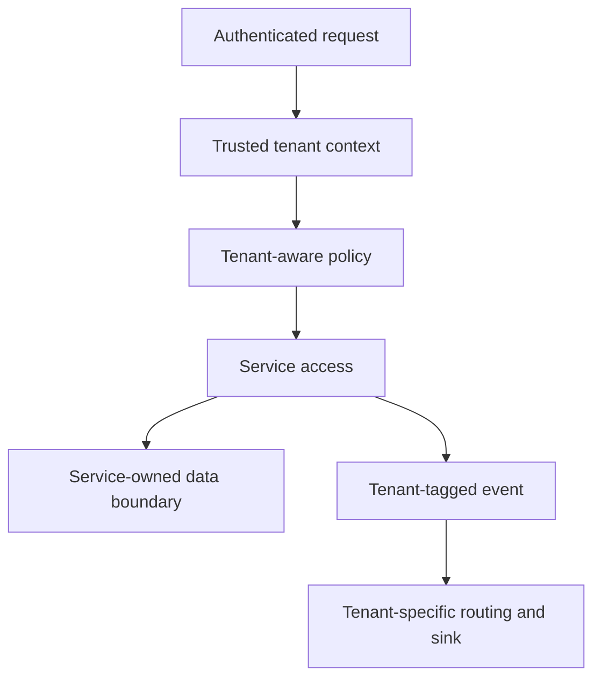

# Scaling & Multi-Tenancy

Scale services according to the work they perform, while preserving tenant isolation in identity, data access, event routing, and operational views.

## Scaling model

| Layer | Scale signal | Typical action |
|---|---|---|
| Stateless gateway services | Request rate, latency, CPU | Add replicas behind the gateway |
| Event processors | Queue depth, processing time, failure rate | Add consumers and tune broker capacity |
| Stateful services | Database connections, slow queries, storage | Scale the data tier and optimize service access |
| Sinks | Ingestion lag, storage growth, query latency | Scale the destination independently |

## Tenant isolation controls

| Control | Intent |
|---|---|
| Tenant identifier | Carry it from authenticated edge through each authorized request |
| Policy | Check tenant-scoped actions before an upstream service receives a request |
| Data access | Never rely on a client-supplied tenant field alone to select data |
| Event routing | Route events only through the pipeline for their tenant context |
| Observability | Scope dashboards and log access appropriately for tenant-sensitive data |

Test isolation as an explicit negative case: a valid identity from one tenant must not access another tenant's data, routes, or event destinations.
