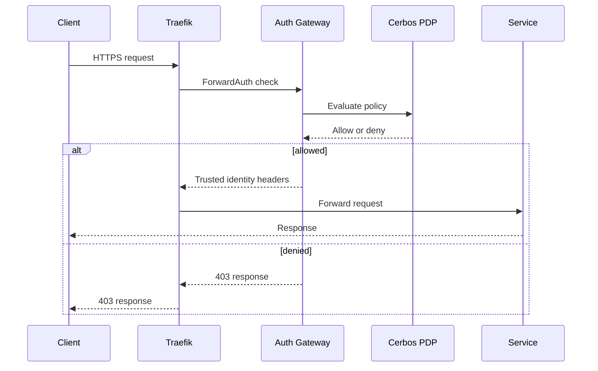

# Traefik Gateway Routing

Traefik is the public routing layer. It sends an incoming request through the Auth Gateway's ForwardAuth check before forwarding traffic to an upstream service.

## Route checklist

| Control | What to verify |
|---|---|
| TLS | Certificates, hostnames, redirects, and renewal process |
| Authentication | Every protected route uses the intended ForwardAuth middleware |
| Authorization | Route and method policies are mapped and tested with allow/deny cases |
| Headers | Only the gateway may inject trusted `X-Auth-*` context headers |
| Webhooks | External callback routes have their own authenticity verification and narrow exposure |
| Rate protection | Public routes have an appropriate rate and abuse-control policy |

Never expose a service's private port simply to bypass a routing problem. Fix the route and its policy instead.
