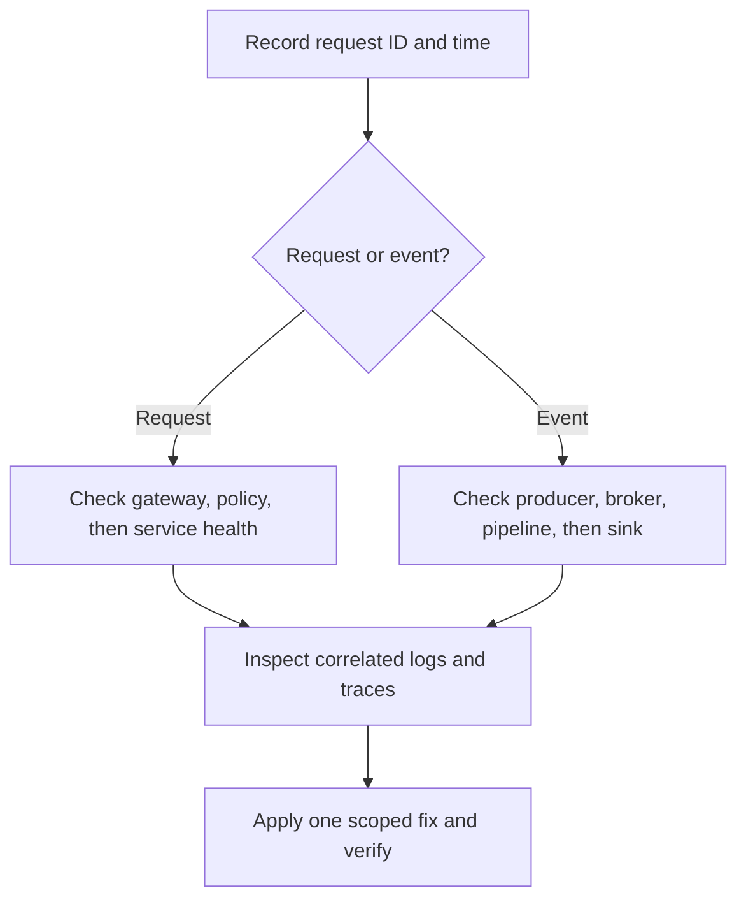

# Troubleshooting

Start with the boundary where the failure becomes visible, then follow the request or event through the platform. Capture the request identifier and time range before collecting logs.

| Symptom | First checks | Likely owner |
|---|---|---|
| Gateway returns 403 | Token issuer, route policy, Cerbos decision logs | Identity / platform team |
| Gateway cannot reach a service | Route target, readiness, Service/Endpoint objects | Platform team |
| Service has 5xx responses | Pod logs, traces, dependency health, configuration | Service owner |
| Events do not reach a sink | Broker connection, queue depth, pipeline match, sink credentials | AuditFlow / platform team |
| Payment state does not update | Provider response, verified webhook delivery, payment logs | Payment integration owner |
| Pods remain Pending | Resource requests, node capacity, PVC and scheduling events | Cluster operator |

## Fast diagnostic sequence

## Useful commands

| Goal | Command |
|---|---|
| List workload health | `kubectl get pods -A` |
| Inspect a failing workload | `kubectl describe pod <pod> -n <namespace>` |
| Read service logs | `kubectl logs deploy/<service> -n <namespace> --since=15m` |
| Check recent events | `kubectl get events -A --sort-by=.lastTimestamp` |

For local onboarding issues, see the legacy [local troubleshooting notes](../getting-started/troubleshooting.md). Keep production fixes narrow, documented, and reversible.
