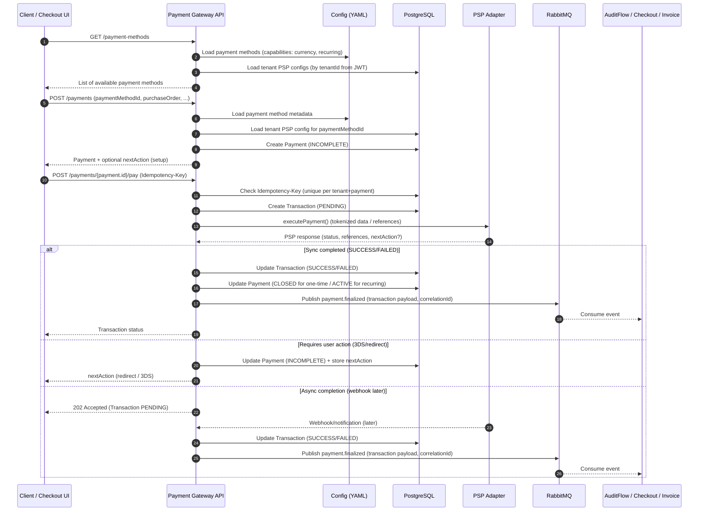

# Payment Gateway Module

Develop a payment gateway module that integrates with multiple Payment Service Providers (PSPs) via a standardized interface (**PSP Adapter**), enabling payment processing across arbitrary platforms. The module should support multiple payment methods, configurable through an external configuration file. Payments are processed on behalf of tenants, with tenant-specific PSP configurations stored in the database and linked to tenant IDs. For this scope, PSP Adapters will be implemented for Stripe, PayPal, and a dummy “No-Op Provider,” with the module designed to allow easy addition of new PSPs in the future. One-time payments must be fully supported end-to-end. Recurring payments are **out of scope for execution** in this freelance task, but the **data model and API must be designed to support recurring payments later**. All transactions must be fully traceable and auditable.

---

## Prerequisites
* Active [GitHub account](https://docs.github.com/en/get-started/onboarding/getting-started-with-your-github-account) for source code access and collaboration
* Own [PayPal developer account](https://developer.paypal.com/) for configuring, testing and integrating payment flows
* Own [Stripe developer account](https://docs.stripe.com/development) for configuring, testing and integrating payment flows

---

## Technical Requirements / Stack

* **Frameworks:**
  * Backend: Java 25, Spring Boot (latest), Spring Framework (latest)
  * Frontend: Typescript, Vue (latest), Vite (latest), ESLint + Prettier, Vue-Router,  Pinia, Vitest, Playwright, Bootstrap, Axios
* **Database:** PostgreSQL (latest)
* **Caching:** Redis
* **Messaging:** RabbitMQ (latest)
* **Containerization:** Docker / concurrent multi-container operations. Assume deployment in Kubernetes
  * Local development uses docker-compose (PostgreSQL + Redis + RabbitMQ).
* **Build Tool:** Maven (latest)
* **API Documentation:** OpenAPI 3.0 (YAML)
* **Authorization:** JWT token verification (OIDC/OAuth2). Tokens are issued by a separate Auth service.

---

## Functional Requirements

### General Architecture

* **Structure:** Module structure should follow the design of the existing [checkout](https://github.com/Labs64/labs64.io-checkout) and [auditflow](https://github.com/Labs64/labs64.io-auditflow) modules.
* **Configuration:** Module static configuration must be managed via Spring Boot, covering:
  * Payment methods / common PSP configuration
  * Currencies support
  * etc.
* **Security:**
  * **Tokenization:** The module must **never** store raw credit card numbers. It must store PSP tokens/IDs (e.g., Stripe `customer_id`, `payment_method_id`).
  * **Resilience:** The `/pay` endpoint (see below) must support an `Idempotency-Key` header to prevent duplicate charges during network failures.
  * **API Security:** All API endpoints must be secured via JWT token (m2m) verification.
  * **Multi-tenancy:** `tenantId` must be taken from the JWT (`tenantId` claim) and used to scope all tenant data .
* **Abstraction:** Introduce a **PSP Abstraction Layer** so new PSPs can be added or maintained easily.
* **Payment States:**
  * `ACTIVE` -  payment is enabled and will be executed on schedule
  * `INCOMPLETE` -  payment setup is incomplete; requires user action
  * `PAUSED` -  payment is temporarily paused but can be resumed later
  * `CLOSED` -  payment is closed and won't be executed anymore
* **Transaction States:**
  * `PENDING` - payment is initiated but not completed yet
  * `SUCCESS` - payment completed successfully
  * `FAILED` - payment attempt failed; will be retried based on dunning logic

#### Authentication & tenant scoping

* **JWT claim names:** the tenant identifier claim name is **`tenantId`**.
* Recommended JWT payload example (user token):

```json
{
  "aud": ["checkout", "payment-gateway"],
  "sub": "user-123",
  "tenantId": "tenant-abs",
  "scope": "po:write payment:write",
  "roles": [],
  "iat": 1707470000,
  "exp": 1707473600,
  "jti": "2f1c1b6a-2c1e-4f2c-9b6b-9e51cdb1c4a0"
}
```

Notes:
- `sub` is the **principal id** (a user id or a service id depending on the token issuer and flow).
- `scope` is a space-separated string (OAuth2-style).
- `roles` may be empty (array).

#### Tenant handling (no Tenant entity in Payment Gateway)

Payment Gateway must **NOT** create or own a Tenant entity.

* Do **not** auto-create tenants on first request.
* Do **not** manage tenant lifecycle in Payment Gateway (create/update/delete/metadata).

`tenantId` (from JWT) is used only as a **scoping key**:

* All tenant-scoped endpoints require `tenantId` (from JWT).
* Database records must include `tenantId`.
* Tenant-specific PSP configuration must be stored **per `tenantId`**.
* Caching / locking keys must include `tenantId`.

#### Configuration conventions (YAML + DB split)

* YAML (Spring Boot config) contains **common/shared** payment methods and capabilities.
* Database stores **tenant-specific** PSP configuration (scoped by `tenantId`).
* Configuration must be overridable in Kubernetes (e.g., ConfigMap / env overrides).

Example (Milestone 1):

```yaml
payment-gateway:
  payment-methods:
    - id: "stripe"
      enabled: true
      name: "Stripe"
      description: "Credit/Debit Card via Stripe"
      recurring: true
      supported-currencies: ["USD", "EUR", "GBP"]
      supported-countries: ["US", "GB", "DE"]
```

Conventions:
* `id` must be unique and stable (internal identifier).
* `supported-currencies` must use ISO-4217 currency codes (e.g., `USD`, `EUR`).
* `supported-countries` must use ISO-3166-1 alpha-2 codes (e.g., `US`, `DE`).

#### Recurring payments scope (this task)

* Recurring payment **execution** (scheduling, renewal engine) is out of scope.
* **Data model + API support** for recurring payments is in scope.
* One-time and recurring payments share the same core states.
* In the future recurring flow, each successful renewal creates a **new Transaction** linked to the same Payment.
* `payment.finalized` will be published for every successful renewal; only confirmed PSP transactions qualify and PSP webhook status is the source of truth.
* Idempotency must be implemented to avoid duplicate events.

#### Retry behavior

* Manual and automatic retries are required.
* Automatic retries must be configurable per PSP/payment method.


### Integration & Messaging

* **API:** Implement a RESTful API (via OpenAPI specification) to manage payment gateway methods.
  * Document all endpoints in OpenAPI YAML
  * Add request/response examples
  * Describe common error model for all endpoints
  * Generate API stubs from the OpenAPI for both **server and client** generation (API-first approach)
* **Queueing:** Final payment transactions should be published to a **RabbitMQ** queue for further processing by other ecosystem modules.

* **Correlation ID:** The `X-Correlation-ID` header must be supported on **every** request.
  * The same correlation id must be included in logs, propagated to downstream HTTP calls, and included in RabbitMQ messages (headers and/or payload).

* **Events:** Publish `payment.finalized` events to RabbitMQ (routing key / topic name: `payment.finalized`).
  * Payload format must be **JSON**.
  * Monetary values are integers in **minor units** (e.g., cents).
  * Consumers must ignore unknown fields (payload evolution is **additive**).

Minimal example:

```json
{
  "event": {
    "id": "01J0QW5JZ6R1J7K8YV9E3N2M1P",
    "type": "payment.finalized",
    "version": 1,
    "occurredAt": "2026-02-10T12:34:56Z"
  },
  "tenantId": "tenant-abs",
  "correlationId": "RSVCZ9NYY9GZNMPXI",
  "payment": {
    "id": "pay_123",
    "status": "COMPLETED",
    "amount": 1299,
    "currency": "USD"
  },
  "transaction": {
    "id": "trx_456",
    "status": "SUCCESS"
  },
  "paymentMethod": {
    "id": "stripe"
  },
  "pspReferences": {
    "provider": "stripe",
    "chargeId": "ch_...",
    "paymentIntentId": "pi_..."
  }
}
```

* **PSP UI Actions:** Handle PSP-specific user actions (redirects, pop-ups, inline payment forms, etc.) as part of Payment Gateway UI integration.
  * PSP specific frontend dependencies should be exported from the PSP Adapter.

---

## User-Driven Payment Flow



## API Proposal

This section outlines the proposed RESTful API endpoints for the Payment Gateway module.  It is not meant to be exhaustive but serves as a starting point for implementation.

Every endpoint supports correlation tracing via the `X-Correlation-ID` header .

### 1. Retrieve Payment Methods

**`GET /payment-methods`**

* **Query Parameters:**
* `currency` (string) *(optional)*: Filter payment methods by supported currency code.
* `country` (string) *(optional)*: Filter payment methods by supported country code.

* **Response:**
* `id` (string): Unique identifier for the payment method.
* `name` (string): Name of the payment method.
* `description` (string): Description of the payment method.
* `icon` (base64) *(optional)*: Data for the PSP icon image.
* `recurring` (boolean): Indicates if the method supports recurring payments.

### 2. Configure PSP for a tenant

**`POST /payment-methods/{paymentMethodId}`**
*Configure specific payment method for the tenant. The tenant is to be determined from the JWT token.*

* **Request Body:**
* `pspConfig` (object): PSP-specific configuration parameters.

* **Response:**
* * No content (204) on success.

### 3. Initiate Payment Instance

**`POST /payments`**
*Initiate a new payment instance (one-time or recurring) and capture payment details. No actual payment will be performed yet! The payment is to be linked with a tenant. The tenant is to be determined from the JWT token.*

* **Request Body:**
* `paymentMethodId` (string): id of the selected payment method.
* `purchaseOrder` (object): Details from the [checkout](https://github.com/Labs64/labs64.io-checkout) module.
  * ... including 
  * `recurring` (boolean): Indicates if the payment is recurring.
* `billingInfo` (object): Billing information.
* `shippingInfo` (object) *(optional)*: Shipping information.
* `extra` (object) *(optional)*: Additional metadata.

* **Response:**
* `payment` (object): The created Payment object.
* `nextAction` (object): returns optional next action required to complete the payment details capture via specific PSP flow.
  * `type` (string): e.g., "none", "redirect", "3ds-challenge".
  * `details` (object): Metadata required for the next action.

### 4. Execute Payment

**`POST /payments/{payment.id}/pay`**
*Execute a payment via external PSP using stored captured payment details and creates payment transaction. For non-recurring payments, this operation closes the payment on success.*

*NOTE: PSP may imply delayed completion of the payment with later notification. Ensure architecture is prepared for handling this scenario by capturing the PSP notification and adjusting the transaction status in the background.*
*Transaction status transitions to `SUCCESS` or `FAILED` are to be published in the queueing service.*

* **Response:**
* `transaction` (object): Payment transaction details.
  * `id` (string): Unique identifier for the transaction.
  * `status` (string): Transaction status.
  * `pspData` (object): Raw data returned from the PSP.

### 5. Payment Status

**`GET /payments/{payment.id}`**
*Retrieve the status and details of an existing payment. Can be used to restore (possibly incomplete) `nextAction` processing*

* **Response:**
* `payment` (object): The created Payment object.
* `nextAction` (object):
  * `type` (string): e.g., "none", "redirect", "3ds-challenge".
  * `details` (object): Metadata required for the next action.

### 6. Close Payment

**`POST /payments/{payment.id}/close`**
*Close an existing payment. No further pay operations can be executed.*

### 7. Transaction Status

**`GET /transactions/{transaction.id}`**
*Retrieve the status and details of a payment transaction.*

* **Response:**
* `transaction` (object): Payment transaction details.
  * `id` (string): Unique identifier for the transaction.
  * `status` (string): Transaction status.
  * `pspData` (object): Raw data returned from the PSP.

---

## Deliverables

* **OpenAPI Spec:** Fully specified YAML file for the RESTful API.
* **Java Module:** Implementing the functionality described above; including PayPal, Stripe and NoOp PSP adapters.
* **Unit Tests:** Covering all major functionalities.
* **Configuration:** 
  * Structured `application.yaml` for integrated payment methods.
  * PSP-specific configuration instructions/templates/examples for a tenant.
* **Database:** Flyway migration scripts in `resources/db/migration`.
* **Dockerfile:** For containerizing the module.
  * Create docker-compose for local development (single instance) including PostgreSQL, Redis, and RabbitMQ.
* **Documentation:** Setup, configuration, usage guide, contributor guide.
* **CI/CD:** `.github` workflows pipeline to build, test.

---

## Milestones

- Total workload will be split into milestones defined as below.
- At the beginning of each milestone, a new PR must be created targeting the main branch of the [Payment Gateway repo](https://github.com/Labs64/labs64.io-payment-gateway).
- Daily work progress must be frequently committed (one daily commit at minimum).
- Early & timely communication via GitHub Issues and PRs only. Expect on-the-fly comments to the commits.
- Each milestone must be approved and merged before proceeding to the next one.
- Scope review and adjustments may be done at the end of each milestone if necessary. Additional work beyond the defined milestones will be treated as out-of-scope and must be agreed separately.
- Approved and merged milestones PRs are considered as completed and entitled for payment.
- Failure to complete a milestone within the agreed timeframe may result in project termination.

---

* **Milestone 1:** Project Setup & Basic Architecture
  * ✅ (done) - Setup Spring Boot project with necessary dependencies.
  * ✅ (done) - Dockerfile and basic CI/CD pipeline.
  * Design OpenAPI specification with generated Java interface and create API stubs with log output.
* **Milestone 2:** PSP Abstraction Layer & NoOp Implementation
  * Implement PSP Abstraction Layer using Strategy Pattern.
  * Create NoOp PSP adapter for testing.
  * Create needed database entities and Flyway migration scripts.
  * Implement all endpoints with basic logic.
* **Milestone 3:** Stripe Integration
  * Implement Stripe PSP adapter.
  * Complete payment flow for Stripe.
  * Unit tests for Stripe integration.
* **Milestone 4:** PayPal Integration
  * Implement PayPal PSP adapter.
  * Complete payment flow for PayPal.
  * Unit tests for PayPal integration.

**Release Condition:** The Pull Request to the [Payment Gateway repo](https://github.com/Labs64/labs64.io-payment-gateway) must be accepted and merged into the main branch to release the freelance payment feature.


---

## Acceptance Criteria

* Code follows standard Java best practices (consistent with `checkout`/`auditflow` modules) and is well-documented.
* **PSP Abstraction Layer** is implemented using the **Strategy Pattern** (e.g., `StripeProvider`, `PayPalProvider`, and `NoOpProvider` implement a common `PaymentProvider` interface).
* **Integrated PSPs:**
  * Stripe (latest API) - https://docs.stripe.com/api
  * PayPal (latest API) - https://developer.paypal.com/api/rest/
  * None (NoOp for testing)
* One-time payments can be demoed with all integrated PSPs using sandbox accounts (personal developer accounts). Recurring payment execution is out of scope for this task.
* **Async Messaging:** RabbitMQ producer is implemented for `payment.finalized` events with transaction payload.
* **Distributed Environments / Kubernetes safety:**
  * All functionality can run reliably on Kubernetes
  * Execution is idempotent to prevent duplicate processing
  * Components are safe to run in parallel across multiple pods
  * Coordination and state handling support distributed execution without race conditions
* **Traceability:** Every log entry and RabbitMQ message must contain a `correlationId` traceable across ecosystem modules.
* Docker container builds successfully and runs without errors.
* All unit tests pass with >80% code coverage.
* API endpoints function exactly as specified in the OpenAPI documentation.
* Logging Policy: no sensitive information in the logs, such as PAN/PII, credentials, etc.
* Payment methods are configurable via YAML and retrievable via API.
* **Vulnerability Scanning:** no `High` and `Critical` vulnerabilities (static code analysis, dependencies, docker, etc.) with GitHub Code scanning / CodeQL, Trivy for Docker
