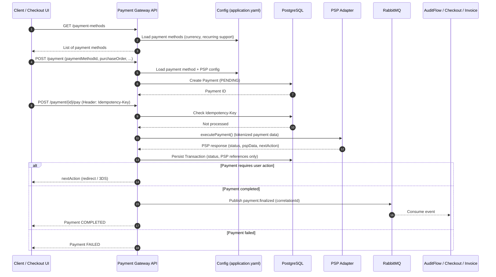
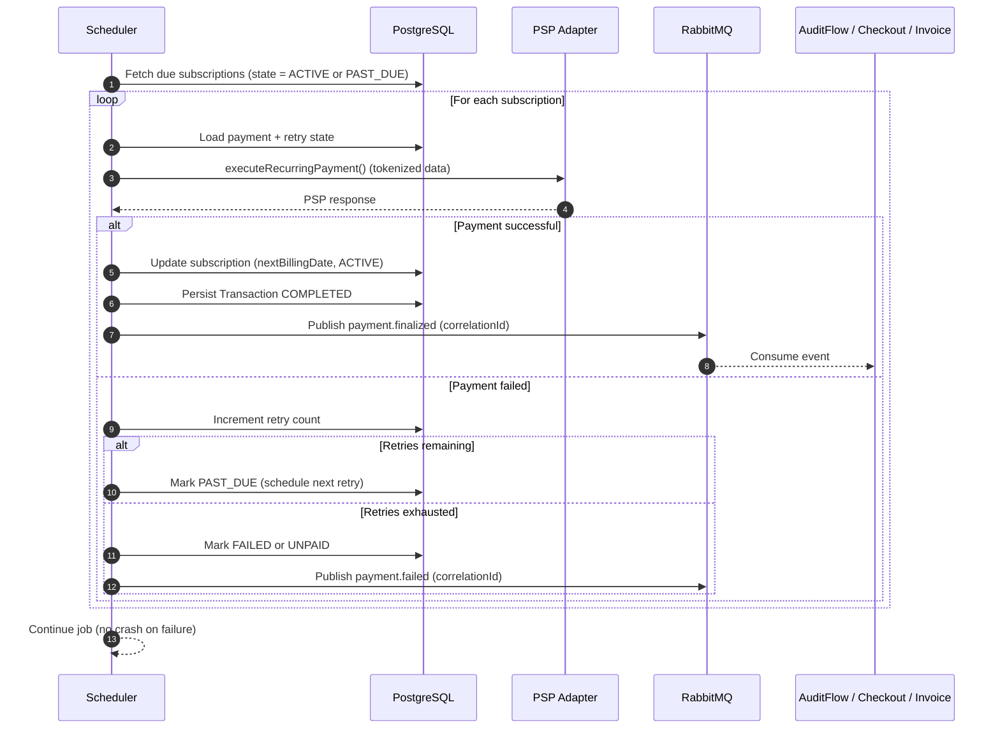

# Payment Gateway Module

Develop a payment gateway module that integrates with various Payment Service Providers (PSPs) via standardized interfaces to handle payment methods for various platforms (e.g., checkout module, individual setup, etc.).
The module should support multiple payment methods and be configurable via an external configuration file. It must also support recurring payments and ensure that all payment transactions are traceable and auditable.

---

## Technical Requirements / Stack

* **Frameworks:** Spring Boot (latest), Spring Framework (latest)
* **Database:** PostgreSQL (latest)
* **Messaging:** RabbitMQ (latest)
* **Containerization:** Docker
* **Kubernetes** (latest)
* **Helm** (latest) - https://github.com/Labs64/labs64.io-helm-charts

---

## Functional Requirements

### General Architecture

* **Structure:** Module structure should follow the design of the existing [checkout](https://github.com/Labs64/labs64.io-checkout) and [auditflow](https://github.com/Labs64/labs64.io-auditflow) modules.
* **Configuration:** Additional module configuration must be managed via an external `application.yaml` file, covering:
  * Payment methods / PSP configuration
  * Currencies support
  * etc.
* **Security:**
  * **Tokenization:** The module must **never** store raw credit card numbers. It must store PSP tokens/IDs (e.g., Stripe `customer_id`, `payment_method_id`).
  * **Resilience:** The `/pay` endpoint must support an `Idempotency-Key` header to prevent duplicate charges during network failures.
  * **Abstraction:** Introduce a **PSP Abstraction Layer** so new PSPs can be added or maintained easily.

### Recurring Payments Engine

Implement recurring payments support with persistence of payment schedules and traceability.

* **Scheduler:** A background job (e.g., Spring Scheduler or Quartz) that scans for due subscriptions.
* **Dunning Logic:** Configurable retry attempts for failed recurring payments (e.g., Retry 3 times: immediately, after 24h, after 3 days).
* **Subscription States:** `ACTIVE`, `PAUSED`, `CANCELED`, `PAST_DUE`, `UNPAID`, `FAILED`.
* **Resilience:** The recurring job must not crash if one subscription fails; it should mark it as failed and proceed to the next.

### Integration & Messaging

* **API:** Implement a RESTful API (via OpenAPI specification) to manage payment gateway methods.
  * Document all endpoints in OpenAPI YAML
  * Add request/response examples
  * Describe common error model for all endpoints
  * Generate API java stubs from the OpenAPI (e.g. **API-first approach**)
* **Queueing:** Final payment transactions should be published to a **RabbitMQ** queue for further processing by the `auditflow`, `invoice`, `checkout`, etc. modules.

---

## User-Driven Payment Flow

## Recurring Payment Flow (Scheduler Job)

## API Specification

### 1. Retrieve Payment Methods

**`GET /payment-methods`**

* **Query Parameters:**
* `currency` (string) *(optional)*: Filter payment methods by supported currency code.
* `country` (string) *(optional)*: Filter payment methods by supported country code.

* **Response:**
* `ID` (string): Unique identifier for the payment method.
* `name` (string): Name of the payment method.
* `description` (string): Description of the payment method.
* `icon` (base64) *(optional)*: Data for the PSP icon image.
* `recurring` (boolean): Indicates if the method supports recurring payments.

### 2. Initiate Payment Instance

**`POST /payment`**
*Initiate a new payment instance (one-time or recurring).*

* **Request Body:**
* `paymentMethodId` (string): ID of the selected payment method.
* `purchaseOrder` (object): Details from the [checkout](https://github.com/Labs64/labs64.io-checkout) module.
  * ... including 
  * `recurring` (boolean): Indicates if the payment is recurring.
  * `frequency` (string): Frequency (e.g., "weekly", "monthly", "yearly").
* `billingInfo` (object): Billing information.
* `shippingInfo` (object) *(optional)*: Shipping information.
* `extra` (object) *(optional)*: Additional metadata.

* **Response:**
* `payment` (object): The created Payment object.

### 3. Cancel Payment Schedule

**`POST /payment/{payment.ID}/cancel`**
*Cancel an existing payment schedule (only for recurring payments).*

### 4. Execute Transaction

**`POST /payment/{payment.ID}/pay`**
*Execute a payment transaction (one-time or recurring) via external PSP using stored payment details.*

* **Response:**
* `transaction` (object): Payment transaction details.
  * `ID` (string): Unique identifier for the transaction.
  * `status` (string): e.g., `PENDING`, `COMPLETED`, `FAILED`.
  * `pspData` (object): Raw data returned from the PSP.
* `nextAction` (object):
  * `type` (string): e.g., "none", "redirect", "3ds-challenge".
  * `details` (object): Metadata required for the next action.

---

## Deliverables

* **OpenAPI Spec:** Fully specified YAML file for the RESTful API.
* **Java Module:** Implementing the functionality described above.
* **Unit Tests:** Covering all major functionalities.
* **Configuration:** Structured `application.yaml` for payment methods.
* **Database:** Flyway migration scripts in `resources/db/migration`.
* **Dockerfile:** For containerizing the module.
  * Create docker-compose for local development
* **Documentation:** Setup, configuration, and usage guide.
* **CI/CD:** `.github` workflows pipeline to build, test, and deploy.

---

## Acceptance Criteria

* Code follows best practices (consistent with `checkout`/`auditflow` modules) and is well-documented.
* **PSP Abstraction Layer** is implemented using the **Strategy Pattern** (e.g., `StripeService`, `PayPalService`, and `NoOpService` implement a common `PaymentProvider` interface).
* **Async Messaging:** RabbitMQ producer is implemented for `payment.finalized` events.
* **Traceability:** Every log entry and RabbitMQ message must contain a `correlationId` traceable across Audit, Invoice, and Checkout modules.
* Docker container builds successfully and runs without errors.
* All unit tests pass with >80% code coverage.
* API endpoints function exactly as specified in the OpenAPI documentation.
* Logging Policy: no sensitive info in the logs, such as PAN/PII, credentials, etc.
* **Integrated PSPs:**
  * Stripe (latest API) - https://docs.stripe.com/api
  * PayPal (latest API) - https://developer.paypal.com/api/rest/
  * None (NoOp for testing)
* Payment methods are configurable via YAML and retrievable via API.
* Recurring payments are correctly scheduled, persisted, and traceable.
* **Vulnerability Scanning:** no `High` and `Critical` vulnerabilities (static code analysis, depencies, docker, etc.) with tools like OWASP ZAP for API, Trivy for Docker

---

> **Release Condition:** The Pull Request to the [Payment Gateway repo](https://github.com/Labs64/labs64.io-payment-gateway) must be accepted and merged into the main branch to release the freelance payment feature.
